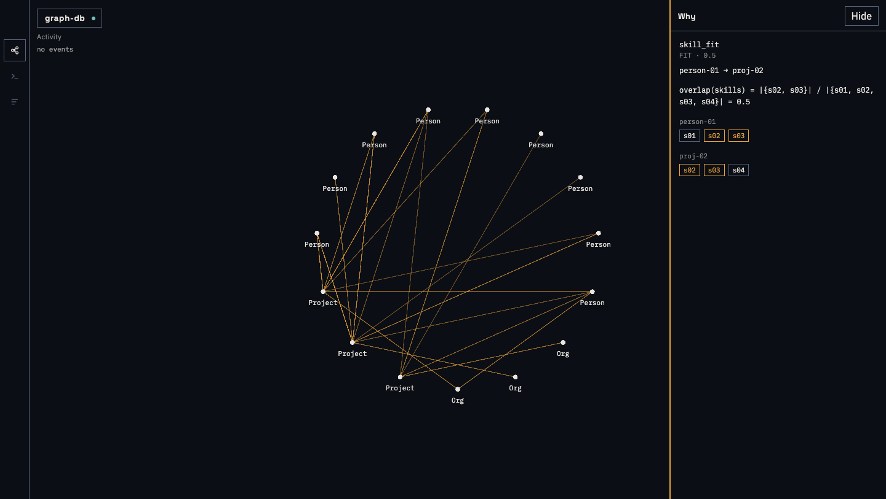
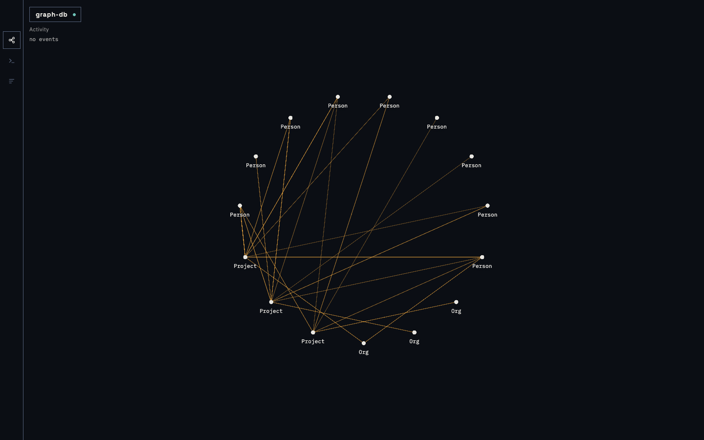

<table border="0">
<tr>
<td width="150" align="center">

</td>
<td>
<h1>mushroomdb</h1>
<p>An embedded Rust property-graph database with native incremental linking rules.
You declare a predicate once; every later write maintains the matching edges
(and retracts them when properties change). The graph builds itself.</p>
</td>
</tr>
</table>

---

## The differentiator

Most graph databases require you to create edges manually or run a batch
similarity script after each load. mushroomdb makes edge creation a schema
declaration. A rule like "connect every Person to every Org whose `skills`
list overlaps theirs by at least 50%" is written once:

```rust
db.create_rule(RuleDef {
    name: "skill_fit".into(),
    src_label: "Person".into(),
    dst_label: "Org".into(),
    predicate: Predicate::Overlap { field: "skills".into(), min: 0.5 },
    edge_type: "FIT".into(),
    weight_prop: Some("score".into()),
    max_edges: Some(5), // keep the 5 best-matching Orgs per Person (top-k per source)
}).expect("rule");
```

After that, every `insert_node` and `set_prop` evaluates the rule
incrementally. The engine writes the edge, stores the Jaccard score, and
retracts the edge if the properties later diverge — without any manual work.

The why panel in the bundled explorer shows exactly which rule fired, the
field values that matched, and the computed score for every derived edge.





### Live rule and write subscriptions

mushroomdb streams derived-edge events in real time. Subscribe to any rule and
receive `EdgeFired` / `EdgeRetracted` events the moment they are committed to
the WAL — not polled, not batched, not delayed by a background job:

```rust
let sub = db.subscribe_rule("skill_fit")?;

// In another thread:
while let Some(ev) = sub.recv_timeout(Duration::from_millis(100)) {
    match ev {
        DbEvent::EdgeFired { src_key, dst_key, weight, commit_seq, .. } => { /* … */ }
        DbEvent::EdgeRetracted { src_key, dst_key, .. } => { /* … */ }
        DbEvent::Lagged { missed } => { /* re-read state if lossless */ }
        _ => {}
    }
}
```

The same stream is available over WebSocket at `GET /subscribe`:

```json
// Client sends:
{"rules": ["skill_fit"], "writes": true}

// Server streams:
{"type":"edge_fired","rule":"skill_fit","src_key":"p1","dst_key":"org-1","edge_type":"FIT","weight":0.87,"commit_seq":42}
{"type":"node_inserted","label":"Person","key":"p2","commit_seq":43}
```

Events arrive after the WAL fsync — a subscriber that queries immediately on
receipt observes the state that produced the event. Each subscription has a
65,536-event bounded queue; slow consumers receive a `Lagged { missed: N }`
marker and continue (no disconnection).

**Measured end-to-end latency** (1 000 events, release build, Apple M4 Pro, 2026-08-21):
commit-to-event-received p50/p95 — in-process: **0.04 µs / 0.21 µs**; over WS on
localhost: **61 µs / 88 µs**. Clock: `std::time::Instant` (monotonic).

See [docs/site/subscriptions.md](docs/site/subscriptions.md) for the full API reference.

### Replay to any commit since your last snapshot

mushroomdb's WAL records every write since the last snapshot. `open_at` replays
that window to any past commit, giving you a read-only view of the graph exactly
as it existed after that write — including which derived edges existed and why:

```rust
// Open a read-only view at commit 5 (since last snapshot).
let db = GraphDb::open_at(&dir, 5)?;

// Why did this edge exist then?
let exps = db.explain("alice", "bob")?;
// → [{rule: "skill_fit", edge_type: "FIT", weight: 0.87, …}]
```

From the CLI:

```sh
mushroomdb asof ./db --commit 5 --query "MATCH (n:Person)-[r:FIT]->(p:Project) RETURN n, p, r.score"
# as-of commit 5 of 42
# columns: n, p, score
#   n=alice  p=proj-01  score=0.87
```

**Scope:** `open_at` reaches commits recorded in the current WAL — those written
since the last `snapshot()`. `snapshot()` truncates the WAL: faster cold starts,
but as-of history restarts from that point. See
[docs/site/timetravel.md](docs/site/timetravel.md) for the full tradeoff and
replay-cost caveats.

### Live degree counts and neighbor aggregates, no triggers

mushroomdb maintains per-node derived properties automatically as the graph
changes.  A degree view counts incident edges; a neighbor-aggregate view sums,
averages, or takes the min/max of a neighbor property — all updated
incrementally on every edge insert, delete, rule fire, or retract.  No cron
jobs, no triggers, no stale caches:

```rust
db.create_view(ViewDef {
    name: "city_population".into(), label: "City".into(),
    view_prop: "pop".into(),
    source: ViewSource::Degree { edge_type: "LIVES_IN".into(), direction: Direction::In },
})?;
// After any edge change, c.pop is instantly correct in every query.
db.query("MATCH (c:City) WHERE c.pop > 1000 RETURN c.name", &Default::default())?;
```

View definitions persist through WAL and snapshots; values rebuild on open in
O(nodes × degree).  Writing to a view prop returns a named error so the guard
is explicit.  See [`docs/site/views.md`](docs/site/views.md).

### The database proposes its own rules

Not sure which rules to declare? mushroomdb can profile your data and suggest
them. Call `db.suggest_rules()` (or `GET /suggest`, or `mushroomdb suggest
./db`) to receive a ranked list of candidate rules with estimated edge counts,
example pairs, and rationale:

```rust
let suggestions = db.suggest_rules();
for s in &suggestions {
    println!("{}: ~{} edges — {}", s.def.name, s.est_edges, s.rationale);
}
// Accept the top suggestion:
if let Some(s) = suggestions.into_iter().next() {
    db.create_rule(s.def)?;
}
```

The profiler detects `_id`-suffix foreign keys (KeyMatch), overlapping token
lists (Overlap), shared low-cardinality strings (FieldEqual), overlapping
numeric ranges (NumericWithin), and equal-dimension float arrays
(VectorSimilar). Sampling is seeded so the same database always returns the
same suggestions. No rule is ever applied automatically. See
[docs/site/suggest.md](docs/site/suggest.md) for the full reference.

---

## Quickstart

The two-command flow uses the release binary with the UI embedded:

```text
mushroomdb demo ./db
mushroomdb serve ./db --addr 127.0.0.1:8080
```

Build the embedded binary first:

```text
cd ui && npm ci && npm run build && cd ..
cargo build -p cli --bin mushroomdb --features embed-ui --release
cp target/release/mushroomdb ~/.local/bin/  # or any directory on PATH
```

Or run directly from the source tree (no copy needed):

```text
./target/release/mushroomdb demo ./db && ./target/release/mushroomdb serve ./db --addr 127.0.0.1:8080
```

Open `http://127.0.0.1:8080/`. The demo graph has 10 Orgs, 20 Projects,
30 People, and 334 edges — 304 of them derived by seven rule sets.

`mushroomdb demo ./db` output:

```text
== demo ==
ingested 10 Orgs, 20 Projects, 30 People
overlap rule: skill_fit (Person.skills ∩ Project.skills, min 0.5)
numeric rule: founded_within (Org.founded_year, tolerance 2)
geo rule: nearby_office (Org.office [lat,lon], 50 km)
vector rule: similar_interests (Person.embedding dim 8, min 0.8)

== auto-FK rules ==
  auto_fk_person_org_id
  auto_fk_person_project_id
  auto_fk_project_org_id

== query ==
MATCH (p:Person {id: 'person-01'})-[r:FIT]->(proj:Project)
RETURN p, proj, r.score AS score
ORDER BY score DESC, proj

columns: p, proj, score
  p=person-01  proj=proj-01  score=1.0
  p=person-01  proj=proj-02  score=0.5
  p=person-01  proj=proj-20  score=0.5

== explain (person-01, proj-01) ==
  rule=auto_fk_person_project_id  type=PROJECT  person-01→proj-01  weight=none
  rule=skill_fit  type=FIT  person-01→proj-01  weight=1.0

== serve ==
  mushroomdb serve ./db
```

`mushroomdb serve ./db --addr 127.0.0.1:8080` output:

```text
listening on http://127.0.0.1:8080
```

Without the embedded binary (cargo only, debug build):

```text
cargo run -p cli --bin mushroomdb -- demo ./demo-db
cargo run -p cli --bin mushroomdb -- serve ./demo-db
```

---

## Rules tour

Six predicate kinds ship today. Predicates compose via `All(...)` (AND, score = min) and `Any(...)` (OR, score = max). Nesting is allowed up to depth 4.

| Predicate | What it tests |
|---|---|
| `KeyMatch` | FK equality — source field matches destination key |
| `FieldEqual` | Exact string match on a named field |
| `Overlap` | Jaccard on list-valued fields, min threshold |
| `NumericWithin` | Absolute numeric difference within a tolerance; score = `1 - |Δ|/tolerance` |
| `GeoRadius` | Haversine distance on `[lat, lon]` fields within km; score = `1 - dist/radius` |
| `VectorSimilar` | Cosine similarity on float arrays, min threshold |

Auto-FK: fields ending in `_id` whose values match existing node keys get
`KeyMatch` rules created automatically at ingest time.

Approximate mode: `VectorSimilar` accepts `approximate: true`, which
switches the candidate path to IVF-Flat. Per-query recall ≥ 0.90
quiesced, ≥ 0.85 immediately post-rebuild. Measured at 5k nodes /
dim 1536: exact ~12 min backfill, approximate ~17 s. Use it when
backfill latency matters more than completeness; document the recall
trade-off for your workload.

Full predicate reference and examples: [`docs/site/rules.md`](docs/site/rules.md).

---

## Benchmarks

10,000-node graph (Apple M4 Pro, macOS 15.7.3, arm64). Full methodology
and honesty notes: [`benchmarks/results/head-to-head-10k-v2.md`](benchmarks/results/head-to-head-10k-v2.md).
Regression results (v2.1 + v2.3, 2026-08-21) are appended to that document.

| Workload | mushroomdb | Neo4j | KùzuDB | Memgraph |
|---|---|---|---|---|
| Bulk ingest | 784 ms | 13.2 s | 1.21 min | 12.5 s |
| Neighborhood depth-1 (p50) | 0.4 µs | 1.22 ms | 99.6 µs | 1.34 ms |
| Neighborhood depth-1 (p95) | 2.2 µs | 1.46 ms | 519 µs | 2.14 ms |
| Neighborhood depth-2 (p50) | 0.2 µs | 7.18 ms | 1.08 ms | 9.22 ms |
| Cypher scan-filter-project (1.4k rows) | 1.22 ms | 93.7 ms | 3.95 ms | 83.7 ms |
| Cypher two-hop join (200 rows) | **261.6 µs** ★ | 3.99 ms ★ | 1.59 ms ★ | 1.96 ms ★ |
| Cold-start (snapshot V5) | **see note** ▽ | — | — | — |
| Server boot-to-ready | n/a (embedded) | 6.6 s | n/a (embedded) | 4.3 s |

*(v2.4 mushroomdb, 2026-08-21, release build; competitor numbers = v2.2 corrected; two-hop row = corrected four-engine benchmark)*

**Honesty notes:**

- mushroomdb numbers are **embedded** (no network RTT, no serialization
  overhead). KùzuDB is also embedded — its numbers are directly comparable
  to mushroomdb's. Neo4j and Memgraph numbers go over bolt/localhost
  (~0.1–1 ms round-trip per query).
- ★ Two-hop join — same dataset, same warmup policy (v2.2 corrected benchmark): all four engines use
  **5,810,000 INDUSTRY_ALIGNMENT edges** (FieldEqual on `industry`; per-source top-k,
  effectively uncapped at 10k scale). Policy: fresh process/container → ingest + preload
  → 3 warmup executions (discarded) → **median of 10 measured runs**. mushroomdb derives
  edges automatically via `create_rule`; competitors pre-loaded via UNWIND MERGE (neo4j,
  memgraph) or COPY FROM CSV (kuzu). All engines return 200 rows.
  Full log: `benchmarks/results/four-way-twohop-20260821-044100.md`.
- v2.1 consolidated-pass two-hop values (2.88 ms neo4j / 2.22 ms kuzu / 2.57 ms memgraph)
  **retracted**: cross-engine contamination confirmed — memgraph cell was neo4j on a warm
  container; see `benchmarks/results/head-to-head-10k-v2.md` contamination section.
  v2 mushroomdb 307 µs **retired**: measured on the old 1M-edge global-budget graph
  (current uncapped graph has 5.81M edges; see dataset growth note in methodology).

Rule derivation (mushroomdb-only, excluded from cross-engine table):
two-rule backfill on 10k nodes: 928 ms + 2.221 s = **3.149 s** (+8.8% vs the pre-eventing v2.3 baseline of 2.894 s; cost of live subscriptions and materialized views). A two-stage fix (is\_empty guard + emit\_deltas engine gate, commit d4d312c) recovered the original +44% regression down to +8.8%. Competitors have no auto-derivation equivalent.

▽ 100k cold-start (V5 snapshot): number being updated in v2.4 regression run (100k db
rebuild required because V4 snapshots are rejected by V5 code). Previous V4 result was
10.5 s open / 36.1 s write cost at 100k scale. V5 adds view_defs to the snapshot format;
open time expected similar. WAL-only baseline: 8.86 min (re-fires all 12 rules; IVF dominates).
See [`dogfood/results/scale-100k.md`](dogfood/results/scale-100k.md) for the updated V5 numbers.

Rule engine vs hand-rolled maintenance (three-way, measured 2026-08-21): on 10k nodes with
1,000 specialty updates, all three strategies produce identical edge sets (drift = 0).
**(a) per-op (expert-written)** (individual `delete_edge`/`insert_edge`, one WAL fsync each): **64.93 min**.
**(b) batched (expert-written)** (uses `batch_edges` — a mushroomdb-only API, one WAL frame per update): **24.98 s**.
**(c) Rule engine** (`create_rule` + `set_prop`, fully automatic): **17.58 s** (1.42× faster than batched).
Add-only pattern (NOT benchmarked — omits retraction; stale edges accumulate on every update).
Disclosures: (1) `batch_edges` was introduced alongside this benchmark to make the comparison fair; it
is not available on any competitor engine. (2) Both hand-rolled variants were written by the engine team
with full knowledge of retraction semantics; drift=0 is a property of expert implementation, not of the
hand-rolled approach in general — real application code typically misses at least one retraction path.
See [`benchmarks/results/handrolled-vs-rules.md`](benchmarks/results/handrolled-vs-rules.md).

---

## Architecture

```
graph-db/
├── crates/
│   ├── core-storage      # topology + columnar properties + WAL + snapshots
│   ├── core-rules        # linking rules, per-rule indexes, incremental maintenance
│   ├── core-query        # vectorized executor; traversal ops + Cypher subset
│   ├── core-api          # the one public Rust interface; typed error enums
│   ├── arrow-bridge      # results ↔ Arrow buffers
│   ├── bindings-python   # PyO3 thin wrapper over core-api
│   ├── server            # axum HTTP + WebSocket; serves UI
│   └── sim-harness       # DST: virtual clock, fault-injecting IO, seeded runner
├── ui/                   # TypeScript + Vite graph explorer
├── bindings/python/      # maturin package
└── cli/                  # mushroomdb binary
```

Dependency rule (inward only):
`bindings/server/cli → core-api → {core-query, core-rules} → core-storage`

Storage uses a CRC-checksummed WAL with per-commit fsync, plus versioned
snapshots in a zero-copy archived format. Open = snapshot + WAL replay.
Derived edges are not WAL-logged; they are re-materialized from node data
on open by replaying rule application.

Concurrency: single writer, many readers via `RwLock`-backed `SharedDb`.
Lock-free epoch snapshot readers are on the roadmap.

Results surface as Apache Arrow everywhere: zero-copy to pandas/polars in
Python bindings, Arrow IPC over WebSocket to the UI.

---

## Known limitations

| Limitation | Detail |
|---|---|
| Two-hop Cypher joins at scale | Dense patterns that produce >1,000,000 intermediate rows still error without `LIMIT`. Add `LIMIT n` to any such query — the pull-based executor stops early and never materializes the full binding table. |
| Cold start without a snapshot re-fires all rules | Snapshots (V5) persist derived edges, IVF state, and view definitions — opening from a snapshot skips re-derivation. Previous V4 result: 10.5 s open at 100k nodes vs 8.86 min from WAL alone; V5 numbers update pending 100k rebuild (see `dogfood/results/scale-100k.md`). Call `snapshot()` before close; a WAL-only open still re-derives everything. Snapshot write cost ~36 s at 100k (V4 baseline). |
| Approximate vector mode is opt-in | `approximate: true` enables IVF-Flat candidate selection. Per-query recall ≥ 0.90 quiesced; ≥ 0.85 post-rebuild. Review the recall trade-off before using it in completeness-critical workloads. |
| Memory-first | The in-memory store is RAM-bound. Design target is 10M nodes (~5–15 GB with properties). mmap-backed storage is on the roadmap. |
| Demo refuses existing directories | `mushroomdb demo` exits 1 if the target directory is non-empty, including hidden files (`.DS_Store` counts). Use a fresh path. |
| Cypher write subset | CREATE, MATCH…SET, MATCH…DELETE (manual edges only), MATCH…DETACH DELETE (node deletes), MATCH…DELETE (isolated-node or edge deletes), and MERGE (single-key match-or-create) are supported. SET RHS accepts a literal or a `$param` reference; expression RHS (`n.x + 1`) is rejected with a named error. Combined MATCH…SET…RETURN is rejected; multi-statement transactions are not supported. Each write statement produces one WAL Batch frame (one fsync). See [`docs/site/query.md`](docs/site/query.md) coverage table. |
| Crash-atomic write batches; no interactive transactions or isolation | `db.write_batch(\|b\| { b.insert_node(...); b.set_prop(...); b.delete_node(...); })` commits all ops in one `WalRecord::Batch` frame (one fsync). On crash replay the frame is all-or-nothing: a torn frame replays as none-applied. Rules fire per op in order — semantically identical to sequential singles. Error semantics: validate-then-apply — if op N fails validation (duplicate key, unknown key, rule-owned edge) the entire batch is rejected and nothing is written or applied. **Not isolated:** readers may observe intermediate states while a committed batch is being applied in memory. Per-query Cypher writes (`query_write`) also produce one Batch frame per statement. Multi-statement BEGIN/COMMIT interactive transactions are not supported in v1. |
| Cypher aggregations | `COUNT(*)`, `COUNT(n)`, `SUM`, `AVG`, `MIN`, `MAX` are supported both as single aggregates and as grouped aggregates (`RETURN a, COUNT(*)`). Multiple group keys and multiple aggregates per query are allowed. Group count is capped at 1,000,000 distinct keys. |
| Variable-length paths: max hops capped at 10 | `-[r:TYPE*min..max]->` and `shortestPath` are supported. Max hops is hard-capped at 10; unbounded forms (`*min..`) are rejected at parse time. Intermediate results are capped at 1,000,000 rows. See [`docs/site/query.md`](docs/site/query.md). |
| WITH pipeline and UNWIND | `WITH` pipeline stages (projection, aliasing, HAVING-style WHERE, ORDER BY, LIMIT, re-entry MATCH) and `UNWIND` list expansion are fully supported. Intermediate rows count against the 1,000,000-row budget. See [`docs/site/query.md`](docs/site/query.md). |
| OPTIONAL MATCH | Left-outer-join semantics: rows failing the optional pattern survive with optional bindings null. Composes with WITH, grouped aggregation (`MATCH (a) OPTIONAL MATCH (a)-[:R]->(b) RETURN a, COUNT(b)` → 0 for edgeless nodes), and WHERE inside the optional scope. Multiple chained OPTIONAL MATCHes on the same anchor are supported. |
| Query parameters | `$name` placeholders are replaced with values supplied at query time. Use `db.query_with_params(cypher, &[("name", value)])` in Rust or `{"params": {...}}` in the HTTP API. Unknown parameters return a named error. Parameters are safe — values are never interpreted as Cypher. |
| Scalar functions | `toLower`, `toUpper`, `size` (strings + lists), `coalesce`, `type(r)`, `abs`, `round` in WHERE and RETURN/WITH. Binary arithmetic (`-`, `*`) is supported inside function arguments (e.g. `abs(n.age - 27)`). Null propagates through all functions except `coalesce`. Unknown function names return a named error listing the supported set. |

---

## What the server and CLI expose

| Command | What it does |
|---|---|
| `mushroomdb demo <dir>` | Write a deterministic demo graph (10 Orgs, 20 Projects, 30 People) |
| `mushroomdb serve <dir>` | Start the HTTP server + optional UI |
| `mushroomdb mcp <dir>` | Start a stdio MCP JSON-RPC server for agent tools |
| `mushroomdb stats <dir>` | Print node/edge/rule counts |
| `mushroomdb algo pagerank <dir> --top 20` | Run PageRank over the unified topology (manual + derived edges) |
| `mushroomdb algo wcc <dir> --top 50` | Find weakly-connected components |
| `mushroomdb algo degree <dir> --top 20` | Degree centrality (out / in / both) |

Full HTTP endpoint reference: [`docs/site/api.md`](docs/site/api.md).

---

## Roadmap

| Priority | Item |
|---|---|
| Medium | Differential-dataflow query subscriptions (incremental result-set updates, not just edge events) |
| Medium | General view expressions (computed transforms and cross-label aggregates) |
| Medium | mmap-backed storage (RAM-independent at rest) |
| Medium | Lock-free epoch snapshot readers (replacing the `RwLock` facade) |
| Medium | Multi-statement transactions (BEGIN/COMMIT) |
| Medium | Expanded Cypher surface (`CASE` expressions, subqueries, `IS NULL/IS NOT NULL`, `+`/`/` arithmetic) |
| Low | TypeScript bindings (napi-rs) |
| Low | WASM playground |

---

## Distribution

Pre-alpha. No tag has been pushed. The one-liners below are the intended
front door **after the first `v*` tag**; they are not available until then.

### Docker (after the first v* tag)

```text
docker run --rm -p 8080:8080 ghcr.io/matthewsherlin/mushroomdb
```

The image CMD runs `mushroomdb serve /data --addr 0.0.0.0:8080 --demo-if-empty`
(writes the demo graph into the volume when empty, then serves).
Explicit two-step:

```text
docker run --rm -v mushroomdb-data:/data ghcr.io/matthewsherlin/mushroomdb demo /data
docker run --rm -p 8080:8080 -v mushroomdb-data:/data ghcr.io/matthewsherlin/mushroomdb serve /data --addr 0.0.0.0:8080
```

Local image build (available now):

```text
docker build -t mushroomdb:local .
docker run --rm -p 8080:8080 mushroomdb:local
```

### TypeScript client (install from repo)

The `mushroomdb-client` package wraps the HTTP + WebSocket API with full TypeScript types.
It is not yet published to npm. Install from the repository:

```sh
npm install /path/to/graph-db/clients/typescript
# or in package.json:
# "mushroomdb-client": "file:../path/to/graph-db/clients/typescript"
```

```ts
import { MushroomClient } from 'mushroomdb-client';

const client = new MushroomClient('http://127.0.0.1:8080');
const result = await client.query('MATCH (p:Person) RETURN p.id LIMIT 5');
console.log(result.rows);
```

See [`clients/typescript/README.md`](clients/typescript/README.md) for the full quickstart, API reference, and WebSocket subscription docs.

### npm (after the first v* tag)

```text
npx mushroomdb --help
```

### curl / install.sh (after the first v* tag)

```text
curl -fsSL https://raw.githubusercontent.com/MatthewSherlin/mushroomdb/main/packaging/install.sh | sh
```

Writes `~/.local/bin/mushroomdb` (no sudo). Fetches the matching GitHub
Release tarball and checksum-verifies it.

---

## Testing

Rust gate (required before every commit touching `crates/`):

```text
cargo fmt --check
cargo clippy --all-targets -- -D warnings
cargo build --workspace --examples
cargo test --workspace
cargo bench --no-run
```

Node gate (commits touching `ui/`):

```text
cd ui && npm ci && npm run typecheck && npm test -- --run && npm run build
```

Python gate (commits touching `bindings/python/`):

```text
cd bindings/python
python -m venv .venv && .venv/bin/pip install -U pip maturin pytest
.venv/bin/maturin develop && .venv/bin/pytest
```

TypeScript client gate (commits touching `clients/typescript/`):

```text
cd clients/typescript && npm ci && npm run typecheck && npm test
```

The test suite uses deterministic simulation testing (fault-injecting
`SimFs`, crash recovery), model-based oracle equivalence testing, and
differential Cypher testing against Neo4j on the supported subset.
See [`CONTRIBUTING.md`](CONTRIBUTING.md) for the full testing philosophy.

---

## Docs

- Quickstart: [`docs/site/quickstart.md`](docs/site/quickstart.md)
- Rules reference: [`docs/site/rules.md`](docs/site/rules.md)
- Live subscriptions: [`docs/site/subscriptions.md`](docs/site/subscriptions.md)
- Time travel (as-of queries): [`docs/site/timetravel.md`](docs/site/timetravel.md)
- Materialized views: [`docs/site/views.md`](docs/site/views.md)
- Full-text search (inverted index, AND/OR/prefix): [`docs/site/fulltext.md`](docs/site/fulltext.md)
- Rule suggestions: [`docs/site/suggest.md`](docs/site/suggest.md)
- Graph algorithms (PageRank, WCC, degree centrality): [`docs/site/algorithms.md`](docs/site/algorithms.md)
- API reference: [`docs/site/api.md`](docs/site/api.md)
- Cypher query reference: [`docs/site/query.md`](docs/site/query.md)
- Design spec: [`docs/design.md`](docs/design.md)
- Benchmarks: [`benchmarks/results/head-to-head-10k-v2.md`](benchmarks/results/head-to-head-10k-v2.md) (v1: [`head-to-head-10k.md`](benchmarks/results/head-to-head-10k.md))
- Dogfood report: [`docs/dogfood-report.md`](docs/dogfood-report.md)

---

## License

Apache-2.0. Copyright 2026 Matthew Sherlin. See [`LICENSE`](LICENSE).
