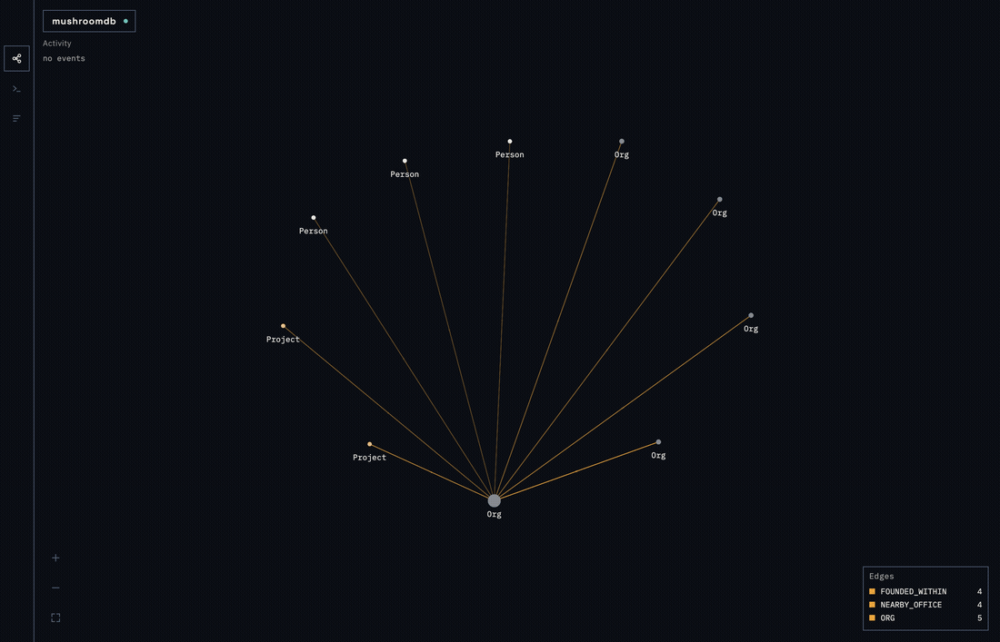
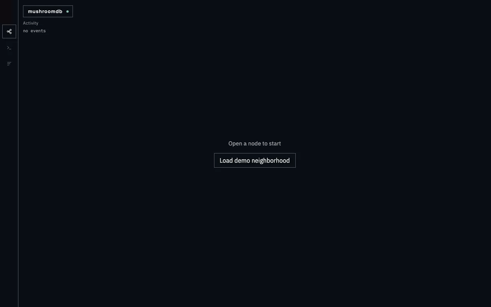
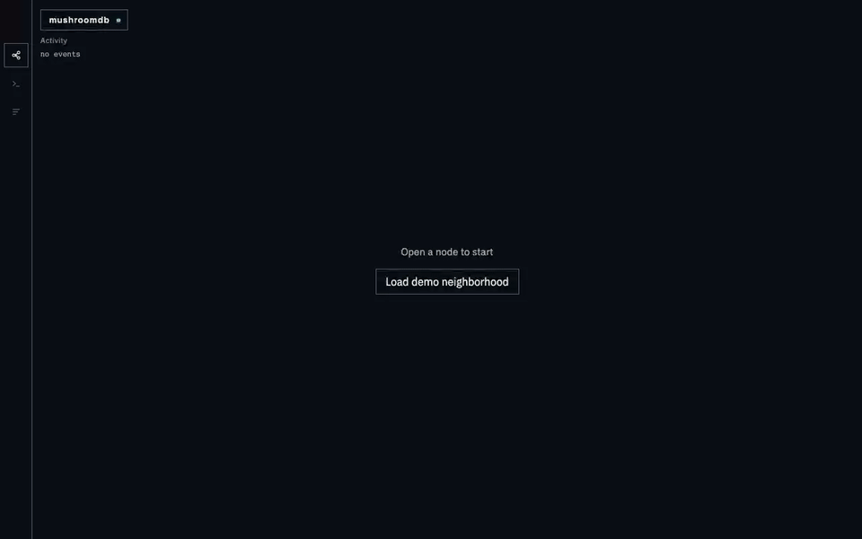
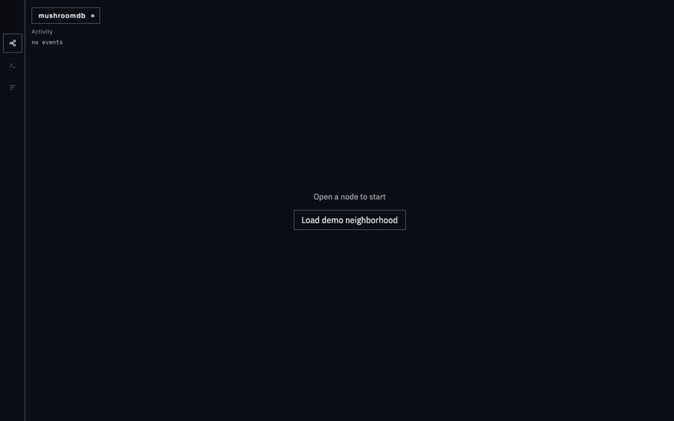
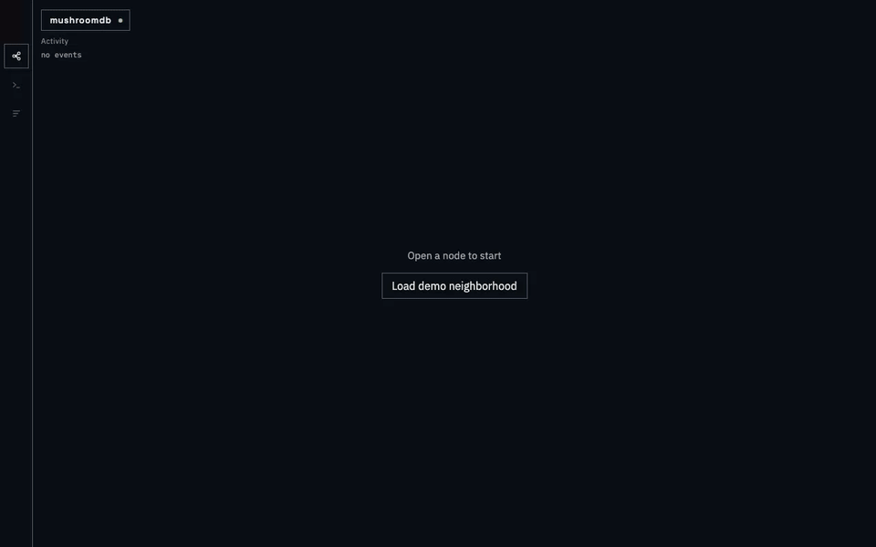

<table border="0">
<tr>
<td width="150" align="center">

</td>
<td>
<h1>mushroomdb</h1>
<p><strong>The association engine for apps and AI agents.</strong>
An embedded Rust graph database where edges are declared, not inserted:
you write rules, the db creates, maintains, and retracts edges automatically
and can explain() why any edge exists. SQLite for relationships.
Built-in MCP server, explainable links, per-node history — a natural fit for
agent memory and small internal apps where matching and relationships are the product.</p>
</td>
</tr>
</table>

---

## The differentiator

Most graph databases require you to create edges manually or run a batch
similarity script after each load. mushroomdb makes edge creation a schema
declaration. A rule like "connect every Person to every Org whose `skills`
list overlaps theirs by at least 50%" is written once:

```rust
db.create_rule(RuleDef {
    name: "skill_fit".into(),
    src_label: "Person".into(),
    dst_label: "Org".into(),
    predicate: Predicate::Overlap { field: "skills".into(), min: 0.5 },
    edge_type: "FIT".into(),
    weight_prop: Some("score".into()),
    max_edges: Some(5), // keep the 5 best-matching Orgs per Person (top-k per source)
}).expect("rule");
```

After that, every `insert_node` and `set_prop` evaluates the rule
incrementally. The engine writes the edge, stores the Jaccard score, and
retracts the edge if the properties later diverge — without any manual work.

The why panel in the bundled explorer shows exactly which rule fired, the
field values that matched, and the computed score for every derived edge.

Watch it live — a Cypher `SET` changes one property, the `founded_within`
rule fires, and new scored edges appear in the explorer:



Open the Rules panel, pick a rule, and the Why slide-over shows the exact
predicate arithmetic behind every derived edge:



Run Cypher in the built-in console and add scored results straight to the
canvas:



A second client ingests a node while the canvas is open — the activity
ticker fires and the graph grows live:





### Live rule and write subscriptions

mushroomdb streams derived-edge events in real time. Subscribe to any rule and
receive `EdgeFired` / `EdgeRetracted` events the moment they are committed to
the WAL — not polled, not batched, not delayed by a background job:

```rust
let sub = db.subscribe_rule("skill_fit")?;

// In another thread:
while let Some(ev) = sub.recv_timeout(Duration::from_millis(100)) {
    match ev {
        DbEvent::EdgeFired { src_key, dst_key, weight, commit_seq, .. } => { /* … */ }
        DbEvent::EdgeRetracted { src_key, dst_key, .. } => { /* … */ }
        DbEvent::Lagged { missed } => { /* re-read state if lossless */ }
        _ => {}
    }
}
```

The same stream is available over WebSocket at `GET /subscribe`:

```json
// Client sends:
{"rules": ["skill_fit"], "writes": true}

// Server streams:
{"type":"edge_fired","rule":"skill_fit","src_key":"p1","dst_key":"org-1","edge_type":"FIT","weight":0.87,"commit_seq":42}
{"type":"node_inserted","label":"Person","key":"p2","commit_seq":43}
```

Events arrive after the WAL fsync — a subscriber that queries immediately on
receipt observes the state that produced the event. Each subscription has a
65,536-event bounded queue; slow consumers receive a `Lagged { missed: N }`
marker and continue (no disconnection).

**Measured end-to-end latency** (1 000 events, release build, Apple M4 Pro, 2026-08-21):
commit-to-event-received p50/p95 — in-process: **0.17 µs / 0.42 µs**; over WS on
localhost: **86 µs / 226 µs**. Clock: `std::time::Instant` (monotonic).

See [docs/site/subscriptions.md](docs/site/subscriptions.md) for the full API reference.

### What was connected when, and why — the temporal story

mushroomdb's differentiator over memory stores like Zep is rule attribution
across time: not just *what* was connected, but *which rule* created each link
and *at which commit* it was added or retracted. Every rule-derived edge writes
a HISTORY-MARKER WAL record at the moment it fires, carrying the rule name as
ground truth. These markers are state no-ops on replay (derived edges are
re-derived from rules deterministically), but they are read by the history APIs
as the authoritative record of *when* and *why* each derived link existed.

```rust
// What edges existed between alice and bob, and when, and why?
let history = db.edge_history("alice", "bob")?;
// [{edge_type: "SIMILAR", commit: 3, event: Added, rule: Some("sim_emb")},
//  {edge_type: "SIMILAR", commit: 7, event: Retracted, rule: Some("sim_emb")}]

// Was SIMILAR active between alice and bob at commit 4?
let linked = db.was_linked("alice", "bob", "SIMILAR", 4)?; // true
```

Over MCP (`edge_history`, `was_linked`, `node_history`) or HTTP
(`GET /history/edge`, `GET /history/was_linked`, `GET /node/{key}/history`),
with role-token masking: hidden nodes return 404, never content.

**As-of time travel:** `open_at` replays the WAL to any past commit, giving a
read-only view of the full graph state at that moment — including which derived
edges existed and why:

```rust
let db = GraphDb::open_at(&dir, 5)?;
let exps = db.explain("alice", "bob")?;
// → [{rule: "skill_fit", edge_type: "FIT", weight: 0.87, …}]
```

From the CLI:

```sh
mushroomdb asof ./db --commit 5 --query "MATCH (n:Person)-[r:FIT]->(p:Project) RETURN n, p, r.score"
# as-of commit 5 of 42
# columns: n, p, score
#   n=alice  p=proj-01  score=0.87
```

**Scope:** `open_at` reaches commits in the current WAL (since the last
truncating `snapshot()`). With `archive_wal: true` and an intact genesis chain,
it also reaches archived WAL segments. Pruned or incomplete genesis chains
return `CommitOutOfRange` — never silently wrong data.

**Compare-and-set writes:** `write_batch_cas` lets concurrent writers check
that a node has not changed since they last read it before committing an update.
`last_changed(key)` returns the commit sequence number of the last write that
touched that node (persisted in V8 snapshot section 11, LAST_CHANGE).

See [docs/site/timetravel.md](docs/site/timetravel.md) for the full temporal
story: history APIs, rule attribution, CAS, archives, retention, and the
horizon contract.

### Live degree counts and neighbor aggregates, no triggers

mushroomdb maintains per-node derived properties automatically as the graph
changes.  A degree view counts incident edges; a neighbor-aggregate view sums,
averages, or takes the min/max of a neighbor property — all updated
incrementally on every edge insert, delete, rule fire, or retract.  No cron
jobs, no triggers, no stale caches:

```rust
db.create_view(ViewDef {
    name: "city_population".into(), label: "City".into(),
    view_prop: "pop".into(),
    source: ViewSource::Degree { edge_type: "LIVES_IN".into(), direction: Direction::In },
})?;
// After any edge change, c.pop is instantly correct in every query.
db.query("MATCH (c:City) WHERE c.pop > 1000 RETURN c.name", &Default::default())?;
```

View definitions persist through WAL and snapshots; values rebuild on open in
O(nodes × degree).  Writing to a view prop returns a named error so the guard
is explicit.  See [`docs/site/views.md`](docs/site/views.md).

### The database proposes its own rules

Not sure which rules to declare? mushroomdb can profile your data and suggest
them. Call `db.suggest_rules()` (or `GET /suggest`, or `mushroomdb suggest
./db`) to receive a ranked list of candidate rules with estimated edge counts,
example pairs, and rationale:

```rust
let suggestions = db.suggest_rules();
for s in &suggestions {
    println!("{}: ~{} edges — {}", s.def.name, s.est_edges, s.rationale);
}
// Accept the top suggestion:
if let Some(s) = suggestions.into_iter().next() {
    db.create_rule(s.def)?;
}
```

The profiler detects `_id`-suffix foreign keys (KeyMatch), overlapping token
lists (Overlap), shared low-cardinality strings (FieldEqual), overlapping
numeric ranges (NumericWithin), and equal-dimension float arrays
(VectorSimilar). Sampling is seeded so the same database always returns the
same suggestions. No rule is ever applied automatically. See
[docs/site/suggest.md](docs/site/suggest.md) for the full reference.

---

## Quickstart

The two-command flow uses the release binary with the UI embedded:

```text
mushroomdb demo ./db
mushroomdb serve ./db
```

Install from crates.io:

```text
cargo install mushroomdb-cli      # `mushroomdb` binary (no embedded UI)
cargo add mushroomdb              # embedded Rust library
```

Or build the embedded-UI binary from source:

```text
cd ui && npm ci && npm run build && cd ..
cargo build -p mushroomdb-cli --bin mushroomdb --features embed-ui --release
cp target/release/mushroomdb ~/.local/bin/  # or any directory on PATH
```

Or run directly from the source tree (no copy needed):

```text
./target/release/mushroomdb demo ./db && ./target/release/mushroomdb serve ./db
```

Open `http://127.0.0.1:8080/`. When a token is configured, open
`http://host:8080/?token=…`. The demo graph has 10 Orgs, 20 Projects,
30 People, and 334 edges — 304 of them derived by seven rule sets.

**Role-bound tokens** limit a caller to a named subset of nodes. Define
roles in `schema.json` under the `roles` key (each role has a `label`
selector list), then pass `--role-token TOKEN:ROLE` (repeatable) when
starting the server, or set `MUSHROOMDB_ROLE_TOKENS="tok1:role1,tok2:role2"`.
A role token receives only the nodes matching its label selectors — read
endpoints return rows filtered to the visible set; write, subscription, and
analytics endpoints return 403. Unknown token or unknown role name: 401.
Corrupt `roles.json`: 500 for role tokens (full-access token unaffected).
The never-widen invariant is enforced in the server: a client-supplied mask
is always intersected with the role mask, never bypassing it. The MCP
interface (`mushroomdb mcp`) is a stdio JSON-RPC server for local agent use
and is not subject to bearer-token or role enforcement.

`mushroomdb demo ./db` output:

```text
== demo ==
ingested 10 Orgs, 20 Projects, 30 People
overlap rule: skill_fit (Person.skills ∩ Project.skills, min 0.5)
numeric rule: founded_within (Org.founded_year, tolerance 2)
geo rule: nearby_office (Org.office [lat,lon], 50 km)
vector rule: similar_interests (Person.embedding dim 8, min 0.8)

== auto-FK rules ==
  auto_fk_person_org_id
  auto_fk_person_project_id
  auto_fk_project_org_id

== query ==
MATCH (p:Person {id: 'person-01'})-[r:FIT]->(proj:Project)
RETURN p, proj, r.score AS score
ORDER BY score DESC, proj

columns: p, proj, score
  p=person-01  proj=proj-01  score=1.0
  p=person-01  proj=proj-02  score=0.5
  p=person-01  proj=proj-20  score=0.5

== explain (person-01, proj-01) ==
  rule=auto_fk_person_project_id  type=PROJECT  person-01→proj-01  weight=none
  rule=skill_fit  type=FIT  person-01→proj-01  weight=1.0

== serve ==
  mushroomdb serve ./db
```

`mushroomdb serve ./db` output:

```text
listening on http://127.0.0.1:8080
```

Without the embedded binary (cargo only, debug build):

```text
cargo run -p mushroomdb-cli --bin mushroomdb -- demo ./demo-db
cargo run -p mushroomdb-cli --bin mushroomdb -- serve ./demo-db
```

---

## Rules tour

Six predicate kinds ship today. Predicates compose via `All(...)` (AND, score = min) and `Any(...)` (OR, score = max). Nesting is allowed up to depth 4.

| Predicate | What it tests |
|---|---|
| `KeyMatch` | FK equality — source field matches destination key |
| `FieldEqual` | Exact match on a named scalar field (string, int, float, bool) |
| `Overlap` | Jaccard on list-valued fields, min threshold |
| `NumericWithin` | Absolute numeric difference within a tolerance; score = `1 - |Δ|/tolerance` |
| `GeoRadius` | Haversine distance on `[lat, lon]` fields within km; score = `1 - dist/radius` |
| `VectorSimilar` | Cosine similarity on float arrays, min threshold |

Auto-FK: fields ending in `_id` whose values match existing node keys get
`KeyMatch` rules created automatically at ingest time.

Approximate mode: `VectorSimilar` accepts `approximate: true`, which
switches the candidate path to in-tree HNSW. Per-query recall: min 0.90,
mean 0.998 at 5k nodes / dim 1536 (fixed-seed probe). Exact backfill at
that scale takes ~12 min; approximate is substantially faster. Use it when
backfill latency matters more than perfect recall; document the recall
trade-off for your workload.

Full predicate reference and examples: [`docs/site/rules.md`](docs/site/rules.md).

---

## Benchmarks

10,000-node graph (Apple M4 Pro, macOS 15.7.3, arm64). Full methodology
and honesty notes: [`benchmarks/results/head-to-head-10k-v2.md`](benchmarks/results/head-to-head-10k-v2.md).
Regression results (v2.1 + v2.3, 2026-08-21) are appended to that document.

| Workload | mushroomdb | Neo4j | KùzuDB | Memgraph |
|---|---|---|---|---|
| Bulk ingest | 784 ms | 13.2 s | 1.21 min | 12.5 s |
| Neighborhood depth-1 (p50) | 0.4 µs | 1.22 ms | 99.6 µs | 1.34 ms |
| Neighborhood depth-1 (p95) | 2.2 µs | 1.46 ms | 519 µs | 2.14 ms |
| Neighborhood depth-2 (p50) | 0.2 µs | 7.18 ms | 1.08 ms | 9.22 ms |
| Cypher scan-filter-project (1.4k rows) | 1.22 ms | 93.7 ms | 3.95 ms | 83.7 ms |
| Cypher two-hop join (200 rows) | **261.6 µs** ★ | 3.99 ms ★ | 1.59 ms ★ | 1.96 ms ★ |
| Cold-start: V8 snapshot open | **0.02 s** ▽ | — | — | — |
| Cold-start: WAL-only open | 8.16 min ▽ | — | — | — |
| Server boot-to-ready | n/a (embedded) | 6.6 s | n/a (embedded) | 4.3 s |

*(v0.1.1 mushroomdb, 2026-08-24, release build; competitor numbers = v2.2 corrected; two-hop row = corrected four-engine benchmark)*

**Honesty notes:**

- mushroomdb numbers are **embedded** (no network RTT, no serialization
  overhead). KùzuDB is also embedded — its numbers are directly comparable
  to mushroomdb's. Neo4j and Memgraph numbers go over bolt/localhost
  (~0.1–1 ms round-trip per query).
- ★ Two-hop join — same dataset, same warmup policy (v2.2 corrected benchmark): all four engines use
  **5,810,000 INDUSTRY_ALIGNMENT edges** (FieldEqual on `industry`; per-source top-k,
  effectively uncapped at 10k scale). Policy: fresh process/container → ingest + preload
  → 3 warmup executions (discarded) → **median of 10 measured runs**. mushroomdb derives
  edges automatically via `create_rule`; competitors pre-loaded via UNWIND MERGE (neo4j,
  memgraph) or COPY FROM CSV (kuzu). All engines return 200 rows.
  Full log: `benchmarks/results/four-way-twohop-20260821-044100.md`.
- v2.1 consolidated-pass two-hop values (2.88 ms neo4j / 2.22 ms kuzu / 2.57 ms memgraph)
  **retracted**: cross-engine contamination confirmed — memgraph cell was neo4j on a warm
  container; see `benchmarks/results/head-to-head-10k-v2.md` contamination section.
  v2 mushroomdb 307 µs **retired**: measured on the old 1M-edge global-budget graph
  (current uncapped graph has 5.81M edges; see dataset growth note in methodology).

Rule derivation (mushroomdb-only, excluded from cross-engine table):
two-rule backfill on 10k nodes: v2.4 baseline 928 ms + 2.221 s = 3.149 s (+8.8% vs pre-eventing v2.3 baseline of 2.894 s). **v0.1.0 measured: 3.49–3.51 s** (two runs, 0.6% intrarun variance; +11% from v2.4). **v0.1.1 re-measured: 2.929 s** (single-pass 2026-08-24; N=5 criterion median 2.878 s — no residual regression vs 2.894 s pre-eventing baseline). A two-stage fix (is\_empty guard + emit\_deltas engine gate, commit d4d312c) recovered the original subscription overhead. Competitors have no auto-derivation equivalent.

▽ 100k cold-start (100k-node representative matching workload, 9 backfill rules,
~10M derived edges in snapshot; warm file cache, cold process; measured
2026-08-28 with `/usr/bin/time -l`, release build, Apple M4 Pro):
**V8 snapshot open:** **0.02 s** (runs 2–3; 0.25 s on first-ever dyld-cold run),
**31–41 MiB RSS** depending on query type — V8 mmap format (v0.2,
`feat/v0.2-phase-b-physics` @ `b0798a1`). Cold-cache not measured (requires
`sudo purge`). **V7 snapshot open:** ~11 s (measured 2026-08-26, three runs
10.7–11.1 s; V7 decompresses packed snapshot on open; no rule re-fire).
**WAL-only open:** 8.16 min (measured 2026-08-24) — CreateRule WAL records trigger
full rule re-derivation; ANN index re-fitting dominates. **V8 snapshot size:**
1.8 GiB (18% smaller than V5's 2.2 GiB; V5 stored IVF state as uncompressed
inline bincode in its meta blob — V8 moves it to a dedicated compact section).
**V8 snapshot write:** ~35 s. **Backfill (9 rules, max_edges=1M each):** 20.343 s.
`mushroomdb verify <db-dir>` audits all 12 sections with full CRC32 and exits 2
on any mismatch (0.26 s on the 1.8 GiB store; large sections skip CRC on the
normal query path — see `docs/format-stability.md` for the trust model).
Full trajectory and methodology:
[`dogfood/results/scale-100k.md`](dogfood/results/scale-100k.md).

Rule engine vs hand-rolled maintenance (three-way, measured 2026-08-21): on 10k nodes with
1,000 specialty updates, all three strategies produce identical edge sets (drift = 0).
**(a) per-op (expert-written)** (individual `delete_edge`/`insert_edge`, one WAL fsync each): **64.93 min**.
**(b) batched (expert-written)** (uses `batch_edges` — a mushroomdb-only API, one WAL frame per update): **24.98 s**.
**(c) Rule engine** (`create_rule` + `set_prop`, fully automatic): **17.58 s** (1.42× faster than batched).
Add-only pattern (NOT benchmarked — omits retraction; stale edges accumulate on every update).
Disclosures: (1) `batch_edges` was introduced alongside this benchmark to make the comparison fair; it
is not available on any competitor engine. (2) Both hand-rolled variants were written by the engine team
with full knowledge of retraction semantics; drift=0 is a property of expert implementation, not of the
hand-rolled approach in general — real application code typically misses at least one retraction path.
See [`benchmarks/results/handrolled-vs-rules.md`](benchmarks/results/handrolled-vs-rules.md).

---

## Architecture

```
graph-db/
├── crates/
│   ├── core-storage      # Packed adjacency topology + columnar property store + WAL + snapshots
│   ├── core-rules        # linking rules, per-rule indexes, incremental maintenance
│   ├── core-query        # pull-based interpreter; traversal ops + Cypher subset
│   ├── core-api          # the one public Rust interface; typed error enums
│   ├── arrow-bridge      # results ↔ Arrow buffers
│   ├── server            # axum HTTP + WebSocket; serves UI
│   ├── cli               # mushroomdb binary
│   └── sim-harness       # DST: virtual clock, fault-injecting IO, seeded runner
├── ui/                   # TypeScript + Vite graph explorer
├── bindings/python/      # PyO3 / maturin
└── clients/typescript/   # HTTP + WebSocket client
```

Dependency rule (inward only):
`bindings/server/cli → core-api → {core-query, core-rules} → core-storage`

Storage uses a dense-id WAL with per-commit fsync (configurable via `FsyncPolicy`),
plus mmap-able V8 rkyv snapshots (12 sections: CSR topology, columnar properties,
HNSW blobs, provenance, IVF state, per-node last-change index, and more — zero-copy,
no heap allocation on open).
V5/V6/V7 stores are auto-migrated to V8 on `GraphDb::open`. Open = mmap header +
lazy section reads; derived edges and ANN state load from snapshot without rule re-fire.
Derived edges are not WAL-logged; they are restored directly from the mmap'd sections.
See [`docs/format-stability.md`](docs/format-stability.md) for the format evolution
contract (append-only WAL discriminants, migrate-on-open, V5+ support, verify command).

Concurrency: single writer, many readers via `RwLock`-backed `SharedDb`.
Lock-free epoch snapshot readers are on the roadmap.

HTTP `POST /query` defaults to Arrow IPC. Python bindings return dicts
(pandas/polars zero-copy is not wired yet). JSON is available via
`?format=json`.

---

## Known limitations

| Limitation | Detail |
|---|---|
| Two-hop Cypher joins at scale | Dense patterns that produce >1,000,000 intermediate rows still error without `LIMIT`. Add `LIMIT n` to any such query — the pull-based executor stops early and never materializes the full binding table. |
| Cold start without a snapshot re-fires all rules | Snapshots (V8 mmap, v0.2+) persist derived edges, ANN state, and view definitions — opening from a snapshot skips re-derivation. Measured at 100k nodes / ~10M derived edges (2026-08-28, warm file cache, cold process): **0.02 s, 31–41 MiB RSS** (V8 mmap). WAL-only open: **8.16 min** (ANN re-fit dominates). Snapshot write cost: ~35 s (1.8 GiB on disk). Call `snapshot()` before close; a WAL-only open re-derives everything. See [`dogfood/results/scale-100k.md`](dogfood/results/scale-100k.md). |
| Approximate vector mode is opt-in | `approximate: true` enables HNSW candidate selection (in-tree, no external dependency). Per-query recall: min 0.90, mean 0.998 at 5k/dim 1536 (fixed-seed probe). Review the recall trade-off before using it in completeness-critical workloads. |
| Memory-first | The in-memory store is RAM-bound. Design target is 10M nodes (~5–15 GB with properties). mmap-backed storage is deferred; see `docs/superpowers/specs/2026-08-25-best-graph-db.md`. |
| Demo refuses existing directories | `mushroomdb demo` exits 1 if the target directory is non-empty, including hidden files (`.DS_Store` counts). Use a fresh path. |
| Cypher write subset | CREATE, MATCH…SET, MATCH…DELETE (manual edges only), MATCH…DETACH DELETE (node deletes), MATCH…DELETE (isolated-node or edge deletes), and MERGE (single-key match-or-create, including `ON CREATE SET` / `ON MATCH SET`) are supported. SET RHS accepts a literal, `$param`, or arithmetic (`n.x + 1`). Combined MATCH…SET…RETURN commits the write then projects from post-write state. Multi-statement transactions are not supported. Each write statement produces one WAL Batch frame (one fsync). See [`docs/site/query.md`](docs/site/query.md) coverage table. |
| Crash-atomic write batches; no interactive transactions or isolation | `db.write_batch(\|b\| { b.insert_node(...); b.set_prop(...); b.delete_node(...); })` commits all ops in one `WalRecord::Batch` frame (one fsync). On crash replay the frame is all-or-nothing: a torn frame replays as none-applied. Rules fire per op in order — semantically identical to sequential singles. Error semantics: validate-then-apply — if op N fails validation (duplicate key, unknown key, rule-owned edge) the entire batch is rejected and nothing is written or applied. **Not isolated:** readers may observe intermediate states while a committed batch is being applied in memory. Per-query Cypher writes (`query_write`) also produce one Batch frame per statement. Multi-statement BEGIN/COMMIT interactive transactions are not supported in v1. |
| Cypher aggregations | `COUNT(*)`, `COUNT(n)`, `SUM`, `AVG`, `MIN`, `MAX` are supported both as single aggregates and as grouped aggregates (`RETURN a, COUNT(*)`). Multiple group keys and multiple aggregates per query are allowed. Group count is capped at 1,000,000 distinct keys. |
| Variable-length paths: max hops capped at 10 | `-[r:TYPE*min..max]->` and `shortestPath` are supported. Max hops is hard-capped at 10; unbounded forms (`*min..`) are rejected at parse time. Intermediate results are capped at 1,000,000 rows. See [`docs/site/query.md`](docs/site/query.md). |
| WITH pipeline and UNWIND | `WITH` pipeline stages (projection, aliasing, HAVING-style WHERE, ORDER BY, LIMIT, re-entry MATCH) and `UNWIND` list expansion are fully supported. Intermediate rows count against the 1,000,000-row budget. See [`docs/site/query.md`](docs/site/query.md). |
| OPTIONAL MATCH | Left-outer-join semantics: rows failing the optional pattern survive with optional bindings null. Composes with WITH, grouped aggregation (`MATCH (a) OPTIONAL MATCH (a)-[:R]->(b) RETURN a, COUNT(b)` → 0 for edgeless nodes), and WHERE inside the optional scope. Multiple chained OPTIONAL MATCHes on the same anchor are supported. |
| Query parameters | `$name` placeholders are replaced with values supplied at query time. Use `db.query_with_params(cypher, &[("name", value)])` in Rust or `{"params": {...}}` in the HTTP API. Unknown parameters return a named error. Parameters are safe — values are never interpreted as Cypher. |
| Scalar functions | `toLower`, `toUpper`, `size` (strings + lists), `coalesce`, `type(r)`, `abs`, `round` in WHERE and RETURN/WITH. Binary arithmetic (`-`, `*`) is supported inside function arguments (e.g. `abs(n.age - 27)`). Null propagates through all functions except `coalesce`. Unknown function names return a named error listing the supported set. |

---

## What the server and CLI expose

| Command | What it does |
|---|---|
| `mushroomdb demo <dir>` | Write a deterministic demo graph (10 Orgs, 20 Projects, 30 People) |
| `mushroomdb serve <dir>` | Start the HTTP server + optional UI (default `127.0.0.1:8080`; `--token` on non-loopback; `--role-token TOKEN:ROLE` for role-bound tokens) |
| `mushroomdb query <dir> <cypher>` | Run a Cypher read or write (`--query` also accepted) |
| `mushroomdb snapshot <dir> [--keep-wal]` | Write `snapshot.bin` (truncates WAL unless `--keep-wal`) |
| `mushroomdb mcp <dir>` | Start a stdio MCP JSON-RPC server for agent tools |
| `mushroomdb stats <dir>` | Print node/edge/rule counts |
| `mushroomdb suggest <dir>` | Rank candidate linking rules (scored top-k 32, KeyMatch 1) |
| `mushroomdb asof <dir> --commit N` | Read-only view at a WAL commit |
| `mushroomdb algo pagerank <dir> --top 20` | Run PageRank over the unified topology (manual + derived edges) |
| `mushroomdb algo wcc <dir> --top 50` | Find weakly-connected components |
| `mushroomdb algo degree <dir> --top 20` | Degree centrality (out / in / both) |
| `mushroomdb verify <dir>` | Audit snapshot integrity: CRC32 all 12 sections, exit 2 on any mismatch (large sections skip CRC on the normal query path; this command reads them all) |
| `mushroomdb schema apply <dir> <schema.json>` | Idempotently apply a schema file (rules, views, fulltext indexes); prints a diff of created/updated/unchanged items |
| `mushroomdb backup <dir> <dest>` | Copy store files to `<dest>` and CRC-verify the copy. WARNING: unsafe against a concurrently running `serve` process — use `POST /backup` for live-served stores |
| `mushroomdb export <dir> <dest> [--format jsonl\|parquet]` | Export nodes, edges, and rules to JSONL (stable, byte-identical) or Parquet (Snappy, not byte-identical across library versions). NaN/Inf floats export as null |

Full HTTP endpoint reference: [`docs/site/api.md`](docs/site/api.md).

---

## Agent Memory

mushroomdb is a natural fit for AI agent memory. Graph structure captures the
semantic shape of real knowledge — entities, associations, similarity, and
lineage — and rule-derived edges keep those associations fresh automatically as
new facts arrive.

**How it works:**

- Entities map to nodes (`Person`, `Document`, `Project`, `Concept`, …).
- Associations are edges derived from data: cosine similarity on embeddings,
  shared field values, FK relationships, geographic proximity, and more.
  Declare a rule once; every write maintains the matching edges without any
  agent-side bookkeeping.
- Recall has three modes: `find_similar` by query vector (HNSW index when
  available, brute-force otherwise); `find_similar` by key (returns neighbors
  from a rule-derived edge type); `query` runs Cypher for structured recall.
- Hybrid search: `hybrid_search` fuses fulltext + vector results via Reciprocal
  Rank Fusion (RRF) — provide `query_text` + `text_field` for text-only, add
  `vector` for a combined ranking.
- Explanations are built in: `explain_association` shows which rules and scores
  produced each link — an agent can cite evidence, not just conclusions.
- Temporal history: `node_history(key)`, `edge_history(a, b)`, and
  `was_linked(a, b, edge_type, at_commit)` return per-node and per-edge WAL
  history with rule attribution — which rule created each derived link, at
  which commit, and when it was retracted. Available over Rust API, MCP tools
  (3 tools), and HTTP (`GET /node/{key}/history`, `GET /history/edge`,
  `GET /history/was_linked`). Useful for audit, provenance, agent replay, and
  change-triggered workflows.
- Query subscriptions: `subscribe_query` (Rust API + WebSocket `/subscribe`)
  delivers incremental Cypher result sets after each commit (supported
  subset; full re-run per commit; use `LIMIT`).
- Node masks (ACL primitive): pass `mask: [key1, key2, …]` to `query` to restrict
  the visible node set; write statements are rejected on masked queries.
- Schema-as-code: `apply_schema` (Rust) / `mushroomdb schema apply` (CLI)
  idempotently applies a JSON schema file (rules, views, fulltext indexes) — no
  WAL writes for items that already match; prints a created/updated/unchanged diff.

**Claude Desktop config** (`~/Library/Application Support/Claude/claude_desktop_config.json`):

```json
{
  "mcpServers": {
    "mushroomdb": {
      "command": "mushroomdb",
      "args": ["mcp", "/path/to/your/db"]
    }
  }
}
```

**Minimal workflow** (four tool calls):

```
upsert_entity  →  create_rule  →  find_similar  →  explain_association
  (store)           (link)           (recall)          (explain)
```

**Agent memory quickstart** (all sixteen MCP tools):

| Tool | Purpose |
|---|---|
| `upsert_entity` | Insert or update a node by key (no existence check needed) |
| `ingest_json` | Batch-ingest nodes of one label from a JSON array |
| `create_rule` | Declare a derivation rule; backfills existing nodes immediately |
| `find_similar` | Find similar nodes by query vector (HNSW) or by derived edge traversal |
| `hybrid_search` | RRF over fulltext + vector results |
| `explain_association` | Show rules and scores that link two nodes |
| `explain` | Alias for `explain_association` |
| `query` | Cypher query (read or write); pass `mask` for ACL-scoped read |
| `neighborhood` | Multi-hop neighborhood traversal with optional edge-type filter |
| `node_info` | Return a node's key, label, and properties |
| `node_edges` | Return all edges incident on a node |
| `stats` | Live node, edge, and rule counts |
| `node_history` | WAL change history for a node (since last truncating snapshot) |
| `edge_history` | Add/retract lifecycle for edges between two nodes, with rule attribution |
| `was_linked` | Point-in-time edge check: was an edge active at a given commit? |
| `rename_node` | Rename a node's key; old_key, new_key |

Full walkthrough, tool reference, and Claude Desktop setup:
[`docs/site/mcp.md`](docs/site/mcp.md).

---

## Roadmap

Phases 1–4 and Plan 18 all landed. What remains:

| Priority | Item |
|---|---|
| Medium | mmap snapshots; lock-free epoch readers |
| Medium | v1.0 format stability (snapshot + WAL semver guarantee) |
| Low | `CASE` / subqueries / `UNION`; napi-rs; WASM |
| Low | Multi-statement `BEGIN/COMMIT` interactive transactions |

---

## Distribution

Pre-alpha. No tag has been pushed. The one-liners below are the intended
front door **after the first `v*` tag**; they are not available until then.

### Docker (after the first v* tag)

```text
docker run --rm -p 8080:8080 -e MUSHROOMDB_TOKEN=… ghcr.io/matthewsherlin/mushroomdb
```

The image CMD runs `mushroomdb serve /data --addr 0.0.0.0:8080 --demo-if-empty`
(writes the demo graph into the volume when empty, then serves). Non-loopback
bind requires a token; pass `-e MUSHROOMDB_TOKEN=…` and open
`http://localhost:8080/?token=…`.
Explicit two-step:

```text
docker run --rm -v mushroomdb-data:/data ghcr.io/matthewsherlin/mushroomdb demo /data
docker run --rm -p 8080:8080 -e MUSHROOMDB_TOKEN=… -v mushroomdb-data:/data ghcr.io/matthewsherlin/mushroomdb serve /data --addr 0.0.0.0:8080
```

Local image build (available now):

```text
docker build -t mushroomdb:local .
docker run --rm -p 8080:8080 -e MUSHROOMDB_TOKEN=… mushroomdb:local
```

### TypeScript client (install from repo)

The `mushroomdb-client` package wraps the HTTP + WebSocket API with full TypeScript types.
It is not yet published to npm. Install from the repository:

```sh
npm install /path/to/graph-db/clients/typescript
# or in package.json:
# "mushroomdb-client": "file:../path/to/graph-db/clients/typescript"
```

```ts
import { MushroomClient } from 'mushroomdb-client';

const client = new MushroomClient('http://127.0.0.1:8080');
const result = await client.query('MATCH (p:Person) RETURN p.id LIMIT 5');
console.log(result.rows);
```

See [`clients/typescript/README.md`](clients/typescript/README.md) for the full quickstart, API reference, and WebSocket subscription docs.

### npm (after the first v* tag)

```text
npx mushroomdb --help
```

### curl / install.sh (after the first v* tag)

```text
curl -fsSL https://raw.githubusercontent.com/MatthewSherlin/mushroomdb/main/packaging/install.sh | sh
```

Writes `~/.local/bin/mushroomdb` (no sudo). Fetches the matching GitHub
Release tarball and checksum-verifies it.

---

## Testing

Rust gate (required before every commit touching `crates/`):

```text
cargo fmt --check
cargo clippy --all-targets -- -D warnings
cargo build --workspace --examples
cargo test --workspace
cargo bench --no-run
```

Node gate (commits touching `ui/`):

```text
cd ui && npm ci && npm run typecheck && npm test -- --run && npm run build
```

Python gate (commits touching `bindings/python/`):

```text
cd bindings/python
python -m venv .venv && .venv/bin/pip install -U pip maturin pytest
.venv/bin/maturin develop && .venv/bin/pytest
```

TypeScript client gate (commits touching `clients/typescript/`):

```text
cd clients/typescript && npm ci && npm run typecheck && npm test
```

The test suite uses deterministic simulation testing (fault-injecting
`SimFs`, crash recovery), model-based oracle equivalence testing, and
differential Cypher testing against Neo4j on the supported subset.
See [`CONTRIBUTING.md`](CONTRIBUTING.md) for the full testing philosophy.

---

## Docs

- Quickstart: [`docs/site/quickstart.md`](docs/site/quickstart.md)
- Rules reference: [`docs/site/rules.md`](docs/site/rules.md)
- Live subscriptions: [`docs/site/subscriptions.md`](docs/site/subscriptions.md)
- Time travel (as-of queries): [`docs/site/timetravel.md`](docs/site/timetravel.md)
- Materialized views: [`docs/site/views.md`](docs/site/views.md)
- Full-text search v2 (BM25, Snowball EN stemming, phrase/negation/prefix): [`docs/site/fulltext.md`](docs/site/fulltext.md)
- Node masks and access control (role tokens, restricted-stub mode): [`docs/site/masks.md`](docs/site/masks.md)
- Rule suggestions: [`docs/site/suggest.md`](docs/site/suggest.md)
- Graph algorithms (PageRank, WCC, degree centrality): [`docs/site/algorithms.md`](docs/site/algorithms.md)
- API reference: [`docs/site/api.md`](docs/site/api.md)
- Cypher query reference: [`docs/site/query.md`](docs/site/query.md)
- Testing (DST, crash sweeps, oracles): [`docs/site/testing.md`](docs/site/testing.md)
- Panic policy (typed corrupt errors, no panics on disk-reachable paths): [`docs/site/panic-policy.md`](docs/site/panic-policy.md)
- Design spec: [`docs/design.md`](docs/design.md)
- Benchmarks: [`benchmarks/results/head-to-head-10k-v2.md`](benchmarks/results/head-to-head-10k-v2.md) (v1: [`head-to-head-10k.md`](benchmarks/results/head-to-head-10k.md))
- Case study: [`docs/dogfood-report.md`](docs/dogfood-report.md)

---

## License

Dual-licensed under [MIT](LICENSE-MIT) or [Apache-2.0](LICENSE-APACHE), at your option.
Copyright 2026 Matthew Sherlin.
