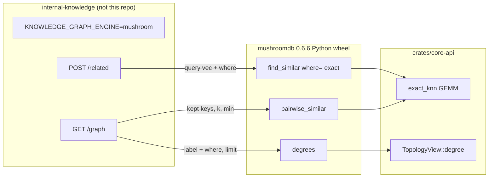
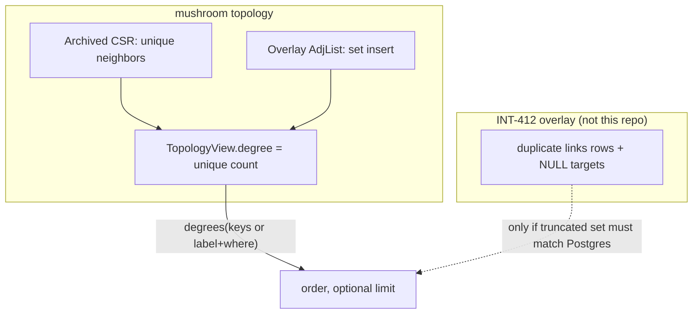

# v0.6.6 — sidecar exact reads: design

**Date:** 2026-09-15
**Status:** Draft, owner-reviewed 2026-09-15 (Q2=sidecar post-filter `1-sim < T`; numbering: next patch **0.6.6**)
**Owner:** Matthew Sherlin
**Branches from:** `feat/v0.6.5-knowledge-base` (workspace version `0.6.5`; 0.6.5
changelog already drafted on this branch). 0.6.7 (scale) and 0.6.8 (hardening)
are specced, not this patch, and are not prerequisites.
**Owner decision it implements (2026-09-14 / 2026-09-15):** the knowledge-base
sidecar must keep **exact result parity** with its current store while moving
kNN, cap ordering, and scoped similarity into the engine. Ownership of a
responsibility may move. Per-node neighbour caps, hub caps, approximate
neighbours, and **precomputed global semantic edges** may not.

This is not a rewrite of 0.6.5, 0.6.7, or 0.6.8. Those documents stay
(scale is 0.6.7, hardening is 0.6.8). This patch is the leftover
**exact-read surface** they deferred or never named.

## 1. Goal

Give the in-process Python sidecar three engine primitives it does not have
today, each exact, each without a snapshot-format bump:

1. **`pairwise_similar(keys, field, k, min)`** — for every key in a caller-
   supplied set, the exact cosine top-k among **that same set**, as one BLAS
   matmul. Self-matches excluded. This is the `LATERAL` kNN-among-kept-ids
   shape, not a global neighbour index.
2. **GEMM-backed exact brute `find_similar`**, plus an additive **`where=`
   property predicate** on the Python `mask` path, so a scoped reader does not
   materialise N readable ids just to pass them back in. Cosine similarity in
   `[-1, 1]`, same kernel as today's scalar loop. HNSW is not this path.
3. **Per-node unique degree / typed incidence readout** that does not
   materialise `EdgeInfo` for the whole graph. Honest about multiplicity:
   adjacency is a set; Postgres row-count incidence (duplicates, unresolved
   targets) stays a sidecar overlay.

When it ships, the sidecar can drop the external vector scan for
`include_semantic=true` and for scoped `/related`, and can order a `/graph`
cap by incidence without walking every edge. The wheel pin moves. Nothing in
this repository's product-facing docs quotes a sidecar latency number.

No benchmark gate. No recall floor is lowered. No MCP tool is added or
reordered (`ASSOCIATION_TOOLS` stays fifteen). No snapshot version bump.

## 2. What is true today (read, not assumed)

Verified on `feat/v0.6.5-knowledge-base`, workspace `0.6.5`, 2026-09-15.

### 2.1 Vector search

| Surface | Signature today | Path |
|---|---|---|
| Rust | `GraphDb::find_similar_vector(field, label, q, k, min) -> Vec<(String, f64)>` | `crates/core-api/src/db.rs` (`find_similar_vector`) |
| Rust masked | `find_similar_vector_masked(..., mask: &NodeMask)` | same file |
| Python | `find_similar(field, vector, label=None, k=10, min=0.0, mask=None)` | `bindings/python/src/lib.rs` |
| MCP | vector mode (`vector`, `field?`, `label?`, `k?`, `min?`, `mask?`) **or** edge-traversal mode (`key`, `edge_type?`, `limit?`) | `crates/server/src/mcp.rs` `tool_find_similar` |
| HTTP | **no** `find_similar` route | `crates/server/src/http.rs` has none |

`mask` is a **list of string keys**. Unknown keys are ignored
(`NodeMask::from_keys`, `crates/core-api/src/mask.rs`). An empty mask hides
every node. There is no property-predicate argument.

Scoring is **cosine similarity via L2-normalised dot**, range roughly
`[-1, 1]`. The brute loop L2-normalises `q` and each candidate, dots, drops
`dot < min`, sorts descending, truncates to `k`
(`find_similar_vector`). HNSW `search` returns `(id, cosine_similarity)`
after converting its internal `1 - dot` distance
(`crates/core-rules/src/hnsw.rs` `search` / `dist_to`). Same unit, different
path.

HNSW is used **when an approximate `VectorSimilar` rule covers the field**;
otherwise the O(n) scalar scan runs. The sidecar that motivates this patch
does not create that rule — it is on the brute path. `find_similar_vector_masked`
on the HNSW path over-fetches `4*k` and post-filters; it can return fewer
than `k` visible hits. That is 0.6.8 Task 5's bug, not this patch's, and
even a widened beam is still approximate. **The sidecar cannot use HNSW
where the current store returns exact kNN.** 0.6.7 scale spec §6 (index-backed
`VectorSimilar`, approximate candidate set, measured recall floor) is a
different path and is forbidden for this consumer.

There is **no `pairwise_similar`**. There is no all-pairs kernel. A
`VectorSimilar` rule that derived `SIMILAR` edges would be global, quadratic
to backfill, and — under 0.6.7 scale — approximate. The written invariant forbids
stored semantic link types.

`min` is a **similarity** floor, inclusive: brute keeps `dot >= min`, HNSW
keeps `sim >= min`, Python documents `score >= min`. Postgres kNN in the
sidecar is **distance** `1 - cosine` with a **strict** `<` (graph semantic
edges: `distance < 0.35`; `/related`: `distance < 0.5`). Engine `>=` does
not change. At `sim == 0.65` (`distance == 0.35`) mushroom-with-`min=0.65`
would keep and Postgres drop. Sidecar conversion is a **post-filter**
`1 - sim < threshold`, not `min = 1 - threshold` (see §6.4, §18). The
engine does not hardcode 5, 0.35, or 0.5.

Dimension is **not** assumed. Vectors are `Value::List` of `Float`/`Int`
(`value_as_float_list`, `db.rs`). After a V8/V9 snapshot, archived all-float
lists sit in `ColumnData::Vector { dim, data, present }`
(`crates/core-storage/src/v8/layout.rs`) and `ColumnsView::vector(id, field)`
returns `&[f64]` for the **base only**. Overlay vectors stay `Value::List`.
The brute loop zips query and candidate and will partially-dot mixed
lengths; that is an accident, not a contract (see §5.3).

Self-matches: `find_similar` is query-vector based, so a node whose
embedding equals `q` appears at similarity 1. There is no `exclude` key.
`pairwise_similar` is the API that must exclude `src == dst`.

### 2.2 Topology is a set

`Topology::add_edge(etype, src, dst) -> bool`
(`crates/core-storage/src/topology.rs`): if `AdjList::contains(dst)` it
returns `false` and does not increment `edge_count`. Frozen+delta merge is
sorted-unique. A second insert of the same `(etype, src, dst)` is a no-op.

`GraphDb::insert_edge` returns `Ok(false)` when
`prepare_insert_edge` sees `has_edge` (`db.rs`). Python `insert_edge` returns
`False` in that case.

`Topology::degree(etype, dir, v)` is `neighbors(...).len()` — **unique
neighbour count**, not a stored counter, and it is **per (etype, dir, vertex)**.
`TopologyView` (`crates/core-storage/src/v8/seam.rs`) exposes `neighbors`,
`edge_count`, `etypes`. **It has no `degree` method.** Archived CSR rows
(`CsrRow.neighbors: Vec<u32>`, unique) are copied into a `Vec` by
`base_neighbors_from_archived` before anyone can ask their length.

`GraphDb::node_edges` walks `etypes × {Out, In} × neighbors()` and
materialises `EdgeInfo` (keys, `derived`). That is the expensive way to
learn a degree. `GraphDb::neighbors(key, edge_type, dir)` is one typed
direction and still materialises keys.

`GraphDb::degree_centrality(&DegreeConfig) -> DegreeReport`
(`crates/core-api/src/algo.rs`) already ranks every live node by unique
directed degree (`AlgoDir::{Out, In, Both}`), with an optional `edge_type`
and a time budget that can set `truncated: true`. It is **not** bound in
Python. It always scans the live node set, not a caller-supplied key list.
A **Degree materialized view** (`ViewSource::Degree { edge_type, direction }`
in `crates/core-rules/src/views.rs`) maintains a property incrementally, but
it is one edge type, it is a write (`create_view`), and `create_view` is
**not** on the Python binding.

So: unique degree exists as an algorithm and as a view, and neither is the
read-only, subset, Python-callable incidence readout the sidecar needs.

**Multiplicity is not stored.** Postgres incidence that counts duplicate
`(src, dst)` rows and `target_doc_id IS NULL` cannot be reproduced from
topology. That gap is INT-412 on the sidecar, not an engine format change.

### 2.3 Predicate masks have landed (0.6.5 §7)

`PropPredicate { field, eq, in_ }` (`crates/core-api/src/roles.rs`): equality
and membership only; missing property fails; `validate` requires exactly one
of `eq` / `in`. Used today as `RoleDef.visible_where`, which narrows the
**labels** leg of a role. `PropPredicate::holds` is the test. Ranges,
negation, nesting are 0.6.5 §10 non-goals and stay out.

`GraphView::nodes_with_prop(label, field, value)` uses `PropertyIndex` when
`(label, field)` is enabled (`crates/core-query/src/view.rs`); otherwise the
caller scans. Python already has `enable_index(label, field)`,
`disable_index`, `is_index_enabled` (`bindings/python/src/lib.rs`).

There is **no** `find_similar(..., where=...)`. A scoped ANN still requires
the caller to pass the key list.

### 2.4 Bindings the sidecar thought were missing

| Item | Status on this branch |
|---|---|
| `edge_history(a, b)` | **Present.** Returns `{a, b, events, total_commits, horizon}` (`lib.rs`). |
| `was_linked` | **Present.** |
| `enable_index` | **Present.** |
| `node_history` | **Present**, dict shape (0.6.5 break). |
| `degree` / `degrees` | **Absent** from Python. |
| `pairwise_similar` | **Absent.** |
| `degree_centrality` | **Absent** from Python. |
| `create_view` | **Absent** from Python. |

`bindings/python/tests/test_parity.py` `_DOCUMENTED` lists every public
method; `edge_history`, `was_linked`, and `enable_index` are already on it.
A sidecar still stubbing `edge_history` at pin `0.6.2` unstubs after the pin
bump. This patch does **not** re-implement them.

### 2.5 BLAS / ndarray

**None** in the workspace. `Cargo.toml` workspace deps are serde, bincode,
crc32fast, proptest, zstd, rkyv, memmap2, criterion. `core-api` and
`core-storage` have no matrix crate. The scalar brute loop is the entire
exact kernel.

### 2.6 What 0.6.5 / 0.6.7 / 0.6.8 already claimed

- 0.6.5 §7: predicate masks on **roles**, not on `find_similar`.
- 0.6.5 §10 / §11: incremental HNSW and index-backed `VectorSimilar` are
  0.6.7 scale. Brute-force vector search "is what the sidecar actually
  runs".
- 0.6.7 scale spec §6: exact `VectorSimilar` rules get an **approximate
  candidate set** with a recall floor. `MUSHROOMDB_VECTOR_SCAN=1` buys the
  proof back at O(n²). The sidecar must not take that trade for `/related`
  or `include_semantic`.
- 0.6.8 Task 5: masked HNSW widens until it has `k` — still HNSW, still not
  this patch.
- Snapshot format is **V9** (0.6.5). 0.6.7 scale promised no bump. This
  patch promises the same.

### 2.7 Deployment report (not for product docs)

Same rule as 0.6.5 §2: these numbers are a sidecar report. They **must not**
appear in `README.md`, `docs/site/**`, `llms*.txt`, or `CHANGELOG.md`.

- 2000 docs / 5397 links; 600 docs / 1791 links.
- `/graph include_semantic=true` at cap 2000 is ~14 s in **both** engines
  today because both call the external LATERAL kNN.
- Unmasked brute `find_similar` ~106 ms at 50k (the number 0.6.5 §11 already
  recorded). Target after GEMM: about 10 ms at 50k × typical embedding dim.
- Scoped `/related` pays a readable-id mask query (~10.5 ms at 2k) plus the
  scan.
- Sidecar embeddings are bge-small, 384-d. The engine does not hardcode 384.

## 3. Consumer contract (Linkt Internal knowledge API)

Out of scope to **implement**. In scope to **name**, so the engine API is
the one the sidecar will call.

- Repo: `internal-knowledge`, `api/src/knowledge/graph/mushroom.py`.
- Flag: `KNOWLEDGE_GRAPH_ENGINE=postgres|mushroom`, default `postgres`.
- Pin today: `mushroomdb==0.6.2` from PyPI. This release is the pin bump
  target (`mushroomdb==0.6.6`).
- Postgres remains source of truth and the only ACL evaluator for INT-412
  until the sidecar moves that itself. Roadmap #1 (ego ACL in-engine) is
  **sidecar-only** (node props + `can_read_doc()`). This patch only notes
  that `enable_index("Document", "resource_scope_id")` already exists.
- Jack's invariant (2026-09-14): **the service returns the same results as
  today. Ownership of a responsibility is not an invariant.** Allowed:
  moving ACL evaluation, kNN, cap ordering into the sidecar. **Not
  allowed:** per-node neighbour caps, hub caps, approximate neighbours
  (HNSW) where Postgres returns exact kNN, **precomputed global semantic
  edges**.
- Parity: equal node set, edge set with `bidirectional` flags, stub set,
  `truncated`, per-node `degree`, `/related` titles and distances to 3 dp,
  same status codes.
- INT-412 (sidecar ticket): truncation gap (Postgres incidence counts every
  `links` row including `target_doc_id IS NULL` and duplicate pairs;
  mushroom counts a deduplicated edge set); dead `_is_wildcard_reader`;
  spec-on-master + wrapper pointer; flag stays off in production. **Not
  this spec**, except the engine must not pretend to store multiplicity.

Jack's mushroom-side items this spec covers:

| # | Sidecar operation | Engine API | Sidecar later |
|---|---|---|---|
| 2 | `GET /graph include_semantic=true`, kept ≤ 2000 | `pairwise_similar(keys, field, k, min)` | Call with the kept set; `k=5`; engine `src != dst` and `score >= min`; sidecar **post-filters** `1 - sim < 0.35` (do not pass `min=0.65`); drop the LATERAL kNN in mushroom mode |
| 3 | `GET /graph` full, `limit=500` | `degree` / `degrees` unique incidence | Enumerate readable nodes; order the cap by unique `Both` (out+in **sum**); fetch edges for the kept set only. See §5.5 / §18 for the Postgres `ORDER BY` citation. |
| 4 | `POST /related k=10`, scoped reader | GEMM brute `find_similar` + `where=` predicate | Pass the scope as the predicate; request `k+1` and drop self; sidecar post-filters `1 - sim < 0.5` (`_MAX_VECTOR_DISTANCE`); delete the readable-id mask query |

Jack's standup (2026-09-15) described #2 loosely as "add semantic embeddings
into MushroomDB as another link type". **The written invariant forbids
that.** This spec specifies read-time `pairwise_similar` and rejects stored
`SIMILAR` / semantic link types (Key Decision 1).



## 4. Non-goals

- **Rewriting the sidecar**, INT-412, the flag default, or ACL evaluation.
- **Stored semantic edges** (`SIMILAR` link type, global neighbour table,
  a `VectorSimilar` rule whose job is to replace LATERAL kNN).
- **HNSW / IVF / 0.6.7 index-backed `VectorSimilar`.** This patch's brute
  GEMM is the exact path. Do not wait on 0.6.7 scale. Do not lower a recall floor.
- **Multi-edges, weighted topology, or a snapshot format bump.** V9 stays V9.
- **Ranges, negation, nesting in `where=`.** `eq` / `in` only, same as
  `PropPredicate`.
- **A new MCP tool, a listing change, or an HTTP `find_similar`.** Python
  is the sidecar's interface. MCP `find_similar` may gain additive `where` /
  `exact` on the existing tool; `ASSOCIATION_TOOLS` stays fifteen in the
  same order.
- **Hardcoding k=5, min=0.65, dim=384, or a distance API.** Caller supplies
  `k` and similarity `min`. Sidecar converts and post-filters distance. The
  engine never speaks `1 - sim`.
- **Namespaces (0.6.7 scale §7), `pump_index_build` (0.6.7 §4), 0.6.8 hardening.**
- **Re-binding `edge_history` / `was_linked` / `enable_index`.** Already
  present.
- **Binding `degree_centrality` or `create_view`.** Different shape; not
  what the sidecar asked for.
- **numpy as a test dependency.** Naive Python cosine is a nested loop.

## 5. Proposed design

### 5.1 Exact cosine kernel (shared)

New module `crates/core-api/src/exact_knn.rs`, used by brute `find_similar`
and by `pairwise_similar`. Not used by HNSW. Not used by `VectorSimilar`
rules.

```rust
/// Row-major packed, L2-normalised f64 matrix. Not persisted.
pub struct PackedVectors {
    pub ids: Vec<u32>,   // row i is node ids[i]
    pub dim: usize,
    pub data: Vec<f64>,  // len == ids.len() * dim, each row unit-length
}

/// Cosine of two already-unit vectors (dot). Test helper only — mixed-dim
/// candidates are skipped, not tailed through this.
pub fn cosine_unit(a: &[f64], b: &[f64]) -> f64;

/// Pack candidates whose `len() == dim` and whose L2 norm is non-zero.
/// Other candidates are omitted (not scored).
pub fn pack<'a, I>(rows: I, dim: usize) -> PackedVectors
where
    I: IntoIterator<Item = (u32, &'a [f64])>;

/// `out[i] = row(i) · q_unit`. `q_unit.len() == packed.dim`.
pub fn gemv(packed: &PackedVectors, q_unit: &[f64]) -> Vec<f64>;

/// `out` is n×n row-major `A Aᵀ`. Diagonal is ~1 for unit rows.
/// Callers must not invoke this for `n > PAIRWISE_GRAM_MAX`.
pub fn gram(packed: &PackedVectors) -> Vec<f64>;
```

The module is **crate-private** (`mod exact_knn;` in `lib.rs`, not `pub mod`).
Kernel unit tests live **in** `src/exact_knn.rs` (`#[cfg(test)]`). Integration
tests in `crates/core-api/tests/` use only public `GraphDb` APIs plus a
nested-loop oracle copied into the test file.

**Shared vector read** (Task 1 names it; used by brute `find_similar` and
`pairwise_similar`):

```rust
/// Overlay-aware f64 view of node `id`'s `field`.
/// Base `ColumnData::Vector` and no overlay/tombstone → `ColumnsView::vector`
/// (`Cow::Borrowed` when aligned). Overlay `Value::List` → owned f64s via
/// `value_as_float_list`. Missing / non-list → `None`.
fn vector_f64<'a>(view: &GraphView<'a>, id: u32, field: &str) -> Option<Cow<'a, [f64]>>;
```

Today's brute uses `view.prop` → `Value::List` materialisation even for
archived Vector columns (`seam.rs` `get` vs `vector`). Without this helper
the GEMM kernel's `&[f64]` contract is wasted on List conversion.

**BLAS:** add workspace dep `matrixmultiply = "0.3"` (**default features
only** — no `threading`, no `cgemm`; `MATMUL_NUM_THREADS` stays unset) and
take it only from `core-api`. Pure-Rust `dgemm`; no system BLAS, no ndarray,
no new ML stack. `dgemm` is `unsafe`: wrap **once** inside `gemv` / `gram`,
never at call sites. `gemv` is a GEMM with `n × dim` against `dim × 1`;
`gram` is `n × dim` against `dim × n`. Empty `n == 0` or `dim == 0` returns
empty without calling dgemm.

**Pairwise n caps** (sidecar design point is kept-set ≤ 2000, ~32 MB gram,
~1.5e9 FLOP — fine). The public API has no inherent cap:

```rust
/// Above this, `pairwise_similar` uses n `gemv`s (O(n·dim) RAM) instead of
/// materialising `A Aᵀ` (O(n²) RAM). Same scores. 2000 sits under this.
pub const PAIRWISE_GRAM_MAX: usize = 4_096;
/// Hard refuse. 50k keys would be a 20 GB gram or a process-killing n-GEMV.
pub const PAIRWISE_MAX_N: usize = 8_192;
```

`n > PAIRWISE_MAX_N` → `Err(GraphError::QueryError { detail })` naming the
limit. `PAIRWISE_GRAM_MAX < n ≤ PAIRWISE_MAX_N` → per-row `gemv` against
the packed matrix, never `gram`. A `#[cfg(test)]` thread-local may lower
both constants (same shape as `HNSW_BUILD_BATCH`). FLOP of n GEMVs equals
FLOP of one gram; RAM does not.

**Normalisation** matches `find_similar_vector` today: skip a vector whose
L2 norm is 0; L2-normalise the rest; score is the dot of unit vectors.

**Cache (optional, in-memory, no format bump).** `GraphDb` may hold

```rust
packed: Mutex<Option<(u64 /* commit_seq */, String /* field */, PackedVectors)>>
```

built on first exact query for `field`, dropped when `commit_seq` moves.
A 50k × 384 f64 pack is ~154 MB; the column store already holds the same
floats in a more expensive shape, so this is a second copy between writes,
not a new durability object. Pairwise packs the **caller key set** on the
fly and does not use this cache (the kept set changes per request).
Implementations that skip the cache and pack per call are correct; the
cache is a latency tactic, not a semantic one.

**Mixed dimension.** Today's scalar loop `zip`s and will partially-dot a
384-d query against a 2-d leftover. That is not a documented contract.
Both the GEMM pack and the scalar helper **skip** a candidate whose
`len() != dim`. Named in the changelog. Sidecar embeddings are uniform.

**Precision.** GEMM accumulation order can differ in the last bits from the
scalar loop. Tests allow `abs(a - b) <= 1e-9` on scores (stricter than the
1e-6 floor) and require **identical key order** after the sort in §5.2.

### 5.2 `pairwise_similar`

```rust
// crates/core-api/src/db.rs
/// Exact cosine top-k for each key in `keys`, scored only against `keys`.
///
/// `min` is cosine similarity in [-1, 1], inclusive (`score >= min`), the
/// same unit and inequality as `find_similar_vector`. Self-matches are
/// excluded. Unknown keys, keys with no `field`, zero-norm or wrong-dim
/// embeddings are omitted as both query and candidate. Duplicate keys are
/// collapsed, first-seen order. Empty `keys` → empty `Ok(vec![])`. Never
/// uses HNSW. `n > PAIRWISE_MAX_N` → `QueryError`.
pub fn pairwise_similar(
    &self,
    keys: &[&str],
    field: &str,
    k: usize,
    min: f64,
) -> Result<Vec<(String, Vec<(String, f64)>)>>;
```

Python:

```python
def pairwise_similar(
    self,
    keys: Sequence[str],
    field: str,
    k: int = 10,
    min: float = 0.0,
) -> list[tuple[str, list[tuple[str, float]]]]:
    """Exact per-key cosine top-k among `keys`. Self excluded. No HNSW."""
```

**Algorithm.**

1. Resolve keys to dense ids (`IdMap::get`). Unknown → skip (same as
   `NodeMask::from_keys`). Dedup preserving order. If the resolved unique
   count exceeds `PAIRWISE_MAX_N`, return `QueryError`.
2. Read each id's vector through `vector_f64` (§5.1). Skip missing /
   zero-norm. **Dim is the modal (max-count) length among remaining
   non-zero vectors**, not the first successful one. Pack only that dim;
   omit the rest as wrong-dim. A single 2-d leftover that sorts ahead of
   384-d embeddings must not zero the kept set. Ties for mode: pick the
   **larger** dim (sidecar embeddings are the long ones).
3. `pack`. If `n ≤ PAIRWISE_GRAM_MAX`, `gram` (one `dgemm`); else n
   `gemv`s against the same packed matrix. Same scores either way.
4. For each packed row `i`, take the other rows with `score >= min`, sort
   `(score desc, dst key asc)`, truncate to `k`. A packed node with no
   surviving neighbour still appears as `(src, [])` so the caller can tell
   "present, nothing similar" from "omitted".
5. **Outer `Vec` order** is first-seen packed keys (input order minus
   skipped). The sidecar must treat it as a **map keyed by src**, not zip
   with `kept_keys`.
6. `k == 0` → every packed src maps to `[]`. `min` above every off-diagonal
   → empty neighbour lists.

**No `where=`, no `mask=`, no `label=`.** The key list *is* the universe.
That is what Postgres `LATERAL` kNN with `d2.id = ANY($1)` computes.
Adding a second filter would invite scoring against a set that is not the
one the caller passed.

**No stored edges.** The result is not written. A later `neighbors(src,
"SIMILAR", "out")` is empty unless a rule or a user edge put something
there. The sidecar turns pairs that survive its **post-filter**
`1 - sim < 0.35` into response edges with a `bidirectional` flag; that is
its business. Engine `min` defaults to `0.0` so the inequality lives in
one place (the sidecar), matching LATERAL's strict `<`.

```mermaid
sequenceDiagram
  participant S as sidecar GET /graph
  participant P as GraphDb.pairwise_similar
  participant K as exact_knn::gram
  S->>P: keys=kept (≤2000), field=embedding, k=5, min=0.0
  P->>P: resolve, modal dim, skip missing/zero/wrong-dim
  P->>K: pack n×d (L2-normalised)
  K-->>P: n×n gram (or n gemv if n>4096)
  P->>P: per row, drop diagonal, score >= min, top-k
  P-->>S: [(src, [(dst, sim), ...]), ...]  first-seen src order
  Note over S: keep if 1-sim < 0.35; treat as a map, do not zip
```

**Unknown-key policy (picked):** skip, do not error. A deleted id in a
stale kept set must not 500 the graph. Empty-after-skip → empty vec.

### 5.3 GEMM brute `find_similar`, and `exact=`

Replace the scalar body of `find_similar_vector` / `_masked` **when no HNSW
index covers the request** with `vector_f64` + `pack` + `gemv` + brute
sort/truncate. HNSW-present behaviour of those two functions **does not
change** — including the HNSW result **sort**, which stays similarity-desc
only as today (0.6.8 Task 5 still has a home). The key-asc tie-break
applies to the **brute path only**. Results on the brute path equal the
old scalar loop within 1e-9, except mixed-dim candidates which both now
skip.

Add one extended entry point. Task 3 makes the two existing signatures
**wrappers** around it (one brute loop, not three):

```rust
pub fn find_similar_vector_filtered(
    &self,
    field: &str,
    label: Option<&str>,
    q: &[f64],
    k: usize,
    min: f64,
    mask: Option<&NodeMask>,
    where_: Option<&PropPredicate>,
    exact: bool,
) -> Result<Vec<(String, f64)>>;
```

`where_` present and failing `PropPredicate::validate_named("where")` →
`Err(GraphError::QueryError { detail })`. Existing
`find_similar_vector` / `_masked` stay `-> Vec<_>`: they call the filtered
entry with `where_=None` and unwrap only that `Ok` (no predicate to
validate; the filtered path is infallible in that configuration). Do not
`unwrap` a `where_=Some` call.

| `exact` / `where_` | HNSW covers field | Path |
|---|---|---|
| `exact=false`, `where_=None` | yes | today's HNSW (masked: 4× over-fetch) |
| `exact=false`, `where_=None` | no | GEMM brute (was scalar brute) |
| `exact=true` **or** `where_=Some(_)` | either | GEMM brute over the candidate set; HNSW is not consulted |

The sidecar that needs Postgres-exact kNN passes `exact=True` (and, for
scoped `/related`, `where=`). `where=` implies exact so a caller cannot
combine a predicate with a silent ANN.

Zero-norm query still returns `[]` (today's behaviour).

**Brute sort:** `(similarity desc, key asc)`. Today's brute sorts
similarity desc only; the key-asc tie-break is additive and makes the
numpy-free Python reference deterministic. Named in the changelog.
**HNSW sort is untouched.**

### 5.4 Additive `where=` on Python `find_similar`

```python
def find_similar(
    self,
    field: str,
    vector: Sequence[float],
    label: str | None = None,
    k: int = 10,
    min: float = 0.0,
    mask: Sequence[str] | None = None,
    where: dict | None = None,
    exact: bool = False,
) -> list[tuple[str, float]]:
```

`mask=` stays a list of strings. Existing callers do not break.

`where=` is a dict with the **same shape as `visible_where`**:

```python
{"field": "resource_scope_id", "eq": "scope-1"}
{"field": "status", "in": ["published", "archived"]}
```

Parsed into `PropPredicate`. **Validation is split once and stated here:**

1. Python (and MCP) parse the dict, call
   `pred.validate_named("where")`, raise `ValueError` / tool error with
   that string, and **never send an invalid predicate into Rust**.
2. `GraphDb::find_similar_vector_filtered` / `degrees` still call
   `validate_named("where")` at the boundary and return
   `Err(GraphError::QueryError { detail })`. That requires `Result<Vec<_>>`
   (Issue: a `Vec` signature cannot carry `QueryError`).
3. `graph_err` maps `QueryError` to `PyRuntimeError`, not `ValueError`
   (`lib.rs`). Python `ValueError` therefore **only** happens from the
   binding's pre-check. Do not rely on the Rust error type for the Python
   type.

`PropPredicate::validate` today hardcodes `"visible_where..."`
(`roles.rs`). Add `validate_named(&self, what: &str)` and keep
`validate()` as `validate_named("visible_where")` so existing rbac tests
and role-load errors are byte-identical. `where=` uses `"where"`. Do not
invent a second predicate type.

Values accept the same plain JSON scalars `PropPredicate` already accepts
(0.6.5). No ranges, no `not`, no nesting.

**Semantics, stated once.**

```
candidates = { n : label? and mask? and holds(where, n.field) }
```

That is an **equation**, not an algorithm. `GraphView::nodes_with_label`
does **not** apply the mask (`view.rs`); `nodes_all` and `nodes_with_prop`
do filter `visible`. Today's brute already special-cases this
(`find_similar_vector_masked` labeled arm: `nodes_with_label` then
`view.visible(id)`). The filtered path **reuses that enumeration**:
`view_masked(mask)` when a mask is present; `visible()` on every label
scan; `nodes_with_prop` on the already-masked view for the index path.

- `label` restricts as today.
- `mask` intersects (never widens), same as role × client mask.
- `where` uses `PropPredicate::holds`. **A missing property fails.** An
  empty `in` matches nothing.
- Comparison is `Value` equality; list properties compare whole, not by
  membership.

**Index fast path.** If `label` is `Some` and `enable_index(label, where.field)`
is on, `eq` is `GraphView::nodes_with_prop` (on the masked view) and `in`
is the union of those lookups. Otherwise scan the label (or all live
nodes) with `visible()`. The sidecar is expected to call
`enable_index("Document", "resource_scope_id")` once; that API already
exists and is not rebuilt.

`where` does **not** go through `roles.json`. It is a query argument, not a
role definition. A role token on HTTP/MCP is a different axis (0.6.5 §7)
and is unchanged.

MCP `find_similar` (existing tool, vector mode) gains optional `where`
(object) and `exact` (bool). Invalid `where` is a tool error. Edge-
traversal mode ignores both. `ASSOCIATION_TOOLS` is not edited.

```mermaid
sequenceDiagram
  participant S as sidecar POST /related
  participant F as GraphDb.find_similar
  participant P as PropPredicate.holds
  participant G as exact_knn::gemv
  S->>F: vector, field, k=11, min=0.0, where={eq scope}, exact=True
  F->>P: filter candidates (masked view; visible() on label scan)
  F->>G: pack + GEMV, no HNSW
  G-->>F: scores
  F-->>S: [(key, sim), ...]  brute sort sim desc, key asc
  Note over S: drop self; keep if 1-sim < 0.5; titles to 3 dp
```

### 5.5 Unique degree / typed incidence

**Honesty first.** Topology cannot store multi-edges without a format/API
change this patch refuses. Postgres incidence = row count including
duplicates and `NULL` targets. Mushroom degree = unique `(etype, src, dst)`
count. INT-412 is the sidecar overlay. A test documents that a second
`insert_edge` of the same triple does not increase degree.

What the engine **can** do, without a format bump: answer unique degree
without materialising `EdgeInfo` and without walking the whole graph when
the caller names a subset.

```rust
// crates/core-storage/src/v8/seam.rs  (and Topology, for overlay-only)
impl TopologyView<'_> {
    /// Unique neighbour count for `(etype, dir, v)`.
    /// Uses archived CSR row length when the overlay has no delta for `v`
    /// and there are no tombstones; otherwise `|overlay ∪ base − tombstones|`
    /// without allocating `EdgeInfo` keys.
    pub fn degree(&self, etype: u32, dir: Direction, v: u32) -> usize;
}

// crates/core-api/src/db.rs
/// Unique directed degree of `key`. Unknown key → `KeyNotFound`.
pub fn degree(
    &self,
    key: &str,
    edge_type: Option<&str>,
    direction: AlgoDir,
) -> Result<u64>;

/// Unique directed degree for a subset or a label scan.
/// Unknown keys in `keys` are omitted (mask-like). `keys = Some(&[])` →
/// empty `Ok(vec![])` (like pairwise / empty mask). `limit` is applied after
/// sorting degree desc, key asc, and only when `Some`. Invalid `where_` →
/// `QueryError`.
pub fn degrees(
    &self,
    keys: Option<&[String]>,
    label: Option<&str>,
    where_: Option<&PropPredicate>,
    edge_type: Option<&str>,
    direction: AlgoDir,
    limit: Option<usize>,
) -> Result<Vec<(String, u64)>>;
```

Python:

```python
def degree(self, key: str, edge_type: str | None = None, direction: str = "both") -> int: ...

def degrees(
    self,
    keys: Sequence[str] | None = None,
    label: str | None = None,
    where: dict | None = None,
    edge_type: str | None = None,
    direction: str = "both",
    limit: int | None = None,
) -> list[tuple[str, int]]: ...
```

`direction` is `"out" | "in" | "both"` (`AlgoDir`). Python parses it with a
**new** `parse_algo_dir` → `AlgoDir`. Leave `parse_dir` (`lib.rs`) alone:
it returns `Direction::{Out, In}` and Python `neighbors` depends on
rejecting `"both"`.

**`AlgoDir::Both` is a sum, not a union.** The enum comment today says
"Treat edges as undirected: Out ∪ In" (`algo.rs`); `degree_centrality`
**adds** `out.len() + in.len()` (a reciprocal pair counts 2 per endpoint).
The new API uses the **sum**, matching that implementation. Task 4 fixes
the `AlgoDir::Both` doc comment so the new API does not inherit the lie.
Do **not** implement `|N_out ∪ N_in|`.

**Cap key, cited.** Postgres `GET /graph` in
`internal-knowledge` `reads.py` `graph()` (INT-135) builds

```python
incidence[source_doc_id] += 1          # every Link row
incidence[target_doc_id] += 1          # if target_doc_id is not None
ordered = sorted(..., key=lambda i: (-incidence[i], str(i)))
```

That is **row-touch count** (out-rows + resolved in-rows), including
duplicate rows and NULL-target source bumps. When the sidecar stores one
directed mushroom edge per `Link` row, unique `Both` **sum** matches that
count except INT-412 (duplicates, `target_doc_id IS NULL`). The JSON
`degree` field on the response is a **different** number: count of
*emitted collapsed* edges after bidirectional fold + semantic edges
(`reads.py` after `_collapse_bidirectional`). Sidecar computes that from
the edge list; do not ask the engine for it.

An unknown `edge_type` yields 0, matching `neighbors` on a missing type.

**Universe.** `keys` if given (`Some([])` → empty result); else `label`
(via `nodes_with_label` + `visible()` if a `where` mask-equivalent is in
play); else all live nodes. `where` intersects. Sidecar cap:

`degrees(label="Document", where={eq scope}, direction="both", limit=500)`
with `Both` = sum.

**Not a dense persisted counter.** Open-time derived arrays would be
correct but are unnecessary if `TopologyView::degree` does not copy the
CSR neighbour list. `base_neighbors_from_archived` today always
`.collect()`s; the degree path reads archived `CsrRow.neighbors.len()`
**without collecting**, and **only** when overlay adj for `(etype, dir, v)`
is empty **and** tombstones for that tuple are empty. Otherwise
`|overlay ∪ base − tombstones|` (set subtract, not `len − tombstone_count`:
`remove_edge` on a missing overlay always records a tombstone, which may
not be in the CSR row, so count-subtract undercounts). Overlay
`AdjList::merged().len()` is O(degree), not O(E). A call over K keys costs
O(K × etypes) length reads, not a walk of every `EdgeInfo`.

**Not `degree_centrality`.** That API ranks the whole live graph, is
budget-truncated, and is not in Python. Do not route the sidecar through
it. Do not bind it as a side effect of this patch.

**Cap ranking vs Postgres.** Duplicate `links` rows or NULL targets can
change who falls inside `limit=500`. That is INT-412. The sidecar that
needs byte-identical truncated sets applies its multiplicity overlay
**before** slicing, by calling `degrees(keys=readable)` without `limit`
and sorting itself.



## 6. API / interface changes

### 6.1 Rust (additive)

| Item | Change |
|---|---|
| `GraphDb::pairwise_similar` | new, `-> Result<Vec<_>>` (cap / `QueryError`) |
| `GraphDb::find_similar_vector_filtered` | new, `-> Result<Vec<_>>` |
| `GraphDb::find_similar_vector` / `_masked` | brute inner loop → GEMM via the filtered entry (wrappers); **signatures unchanged** (`-> Vec`) |
| `GraphDb::degree` / `degrees` | new; `degrees` is `-> Result<Vec<_>>` |
| `TopologyView::degree` / `Topology::degree` (typed, already exists on `Topology`) | `TopologyView` gains `degree`; CSR path does not copy neighbours |
| `crates/core-api/src/exact_knn.rs` | new module; `lib.rs` `mod exact_knn` (**crate-private**; public fns on `GraphDb`) |
| `PropPredicate::validate_named` | new; `validate()` stays `"visible_where"` |
| `matrixmultiply` | workspace dep `"0.3"`, **default features**, `core-api` only |

No new `GraphError` variants. `degree` uses existing `KeyNotFound`. Invalid
`where` at the `GraphDb` boundary is `QueryError { detail }` after
`validate_named("where")`. Python validates first and raises `ValueError`;
a Rust caller that skips that sees `QueryError` mapped to `PyRuntimeError`
if it went through the binding without the pre-check.

### 6.2 Python

| Method | Change |
|---|---|
| `find_similar` | additive kwargs `where=None`, `exact=False`; `.pyi` + `text_signature` |
| `pairwise_similar` | new pymethod |
| `degree` / `degrees` | new pymethods |
| `test_parity.py` `_DOCUMENTED` | append the three new names |
| `edge_history` / `enable_index` / `was_linked` | **untouched** |

### 6.3 MCP / HTTP

- MCP `find_similar` vector mode: optional `where`, `exact`. Listing
  unchanged. **Do not change the MCP default `min`.** Today it is **0.8**
  (`mcp.rs` `unwrap_or(0.8)`); Python defaults to **0.0**. Additive
  `where`/`exact` must not "fix" that. Sidecar is Python, so not a
  consumer bug.
- No `pairwise_similar` tool. No `degrees` tool.
- HTTP: no new route. `/algo/degree` stays the centrality algorithm.

### 6.4 Sidecar conversion (documentation in this spec only)

One formula, one inequality on each side of the boundary:

```
sim      = mushroom cosine                 # [-1, 1]
distance = 1.0 - sim                       # LATERAL <=>  cosine distance
engine   keeps if sim >= min               # inclusive; do not change
sidecar  keeps if distance < T             # strict; T = 0.35 graph, 0.5 /related
```

**Do not pass `min = 1 - T`.** At `sim == 0.65` (`distance == 0.35`)
engine-with-`min=0.65` keeps and Postgres drops. Pass `min=0.0` (or omit)
and **post-filter** `1 - sim < T`. Boundary unit example: a pair with
cosine `0.65` exactly is **absent** from the sidecar's semantic-edge set
and **present** in the engine result if `min=0.65`. That is why the sidecar
post-filters instead of passing `min=0.65`. Owner 2026-09-15: post-filter.

## 7. Data model changes

**None.** No WAL record, no snapshot section, no `roles.json` version, no
HNSW blob version. Packed matrices are RAM, keyed by `commit_seq`, discarded
on write. V9 stays V9. `format-compat` fixtures are not edited.

If an implementer believes a format bump is required, they stop and write
down why. The expected finding is that it is not.

## 8. Tests (named)

New file `crates/core-api/tests/exact_knn.rs` unless a task says otherwise.
Python: `bindings/python/tests/test_exact_reads.py` plus `_DOCUMENTED`
updates. No `#[ignore]` recall test is touched.

**Pairwise**

- `pairwise_similar_equals_naive_all_pairs` — 32 vectors, dim 8, fixed seed.
  Engine output equals a nested-loop cosine in the test (L2-normalise, dot,
  drop diagonal, `min`, top-`k`, sort sim desc / key asc) to `1e-9`.
- `pairwise_similar_excludes_self` — a node is never in its own neighbour
  list, including when it is the unique nearest to itself.
- `pairwise_similar_respects_k_and_min` — `k=2` returns at most 2; a pair
  under `min` is absent.
- `pairwise_similar_unknown_keys_are_skipped` — `"ghost"` in the key list
  does not error and does not appear.
- `pairwise_similar_empty_keys_returns_empty`.
- `pairwise_similar_missing_embeddings_are_skipped` — a key with no `field`,
  a zero vector, and a wrong-dim vector are omitted, not a panic.
- `pairwise_similar_does_not_use_hnsw` — with an approximate `VectorSimilar`
  rule covering `field`, pairwise still equals the naive kernel (force a
  case HNSW would get wrong if it were consulted, or assert via the
  `hnsw_search_count` test-hook that pairwise performs zero searches).
- `pairwise_similar_modal_dim_not_first` — keys ordered `[2-d leftover,
  …8-d (or 384-d)…]` still returns the majority-dim pairwise graph; the
  leftover is omitted, not used as `dim`.
- `pairwise_similar_gram_fallback_equals_naive` — with the test hook
  lowering `PAIRWISE_GRAM_MAX` below the fixture n, results still equal
  the nested-loop oracle (gemv fallback, not gram).
- `pairwise_similar_refuses_above_max_n` — n above `PAIRWISE_MAX_N` (hook-
  lowered) returns `QueryError` naming the limit.
- `pairwise_similar_boundary_min_inclusive` — a pair scoring exactly
  `min` is **kept** by the engine (`>=`). Documents the sidecar post-filter
  obligation; does not switch pairwise to `>`.

**GEMM brute**

- `gemm_brute_equals_scalar_on_256` — 256 vectors, dim 16 (and a second
  case dim 64). For 20 queries, `find_similar_vector` (no rule → brute)
  vs a **nested-loop oracle in the test file** (not `exact_knn::`, which
  is crate-private): keys equal, scores within `1e-9`. After Task 1 this
  stays green if GEMM matches scalar on uniform dim — the revert-to-fail
  test is `mixed_dim_candidate_is_skipped`, not this one.
- `find_similar_vector_without_edges` (`crates/core-api/tests/rules.rs`)
  **keeps passing unedited** — brute path still ranks `a, b, c` as today
  (2-d fixture, uniform dim).
- `exact_true_skips_hnsw` — approximate rule present; `exact=true` returns
  the brute answer, not the ANN answer, on a fixture where they differ
  (or, if they do not differ at this size, the search-count hook is zero
  under `exact=true` and non-zero under `exact=false`).
- `mixed_dim_candidate_is_skipped` — a 3-d leftover next to 8-d vectors
  does not appear, on both GEMM and scalar.

**`where=`**

- `find_similar_where_eq_matches_key_list_mask` — three `Document` nodes,
  `resource_scope_id` in `{a, a, b}`; `where={field, eq: a}` returns the
  same key set as `mask=[those two keys]` (order and scores equal).
- `find_similar_where_in_matches_union_of_eq`.
- `find_similar_where_missing_property_fails` — a node without the field
  is absent.
- `find_similar_where_empty_in_matches_nothing`.
- `find_similar_where_and_mask_intersect` — never widens.
- `find_similar_label_and_mask_and_where` — labeled scan + key-list mask +
  `where` together; a node that matches the label and `where` but is
  absent from `mask` does not appear (the `nodes_with_label` footgun).
- `find_similar_where_uses_property_index_when_enabled` — `enable_index`
  then `where eq`; result identical to the unindexed scan. Optional
  `#[cfg(test)]` counter on `PropertyIndex::lookup` proves the index was
  hit; if that is too invasive, identity against the scan is enough.
- `find_similar_where_invalid_is_refused` — both `eq` and `in` set.
- `find_similar_mask_only_still_allows_hnsw` — existing
  `crates/core-api/tests/masked_ann.rs` HNSW cases **unedited**.

**Degree**

- `degree_matches_neighbors_len` — after N unique edges of one type out of
  `a`, `degree(a, Some(etype), Out) == neighbors(a, etype, Out).len()` and
  does not require the caller to iterate edges.
- `duplicate_edge_does_not_increase_degree` — second `insert_edge` returns
  `false`; `degree` unchanged. **This is the multiplicity honesty test.**
- `degrees_subset_does_not_require_full_graph_walk` — two components; 
  `degrees(keys=[left])` does not need the right-hand edges to be correct
  (assert values; a `#[cfg(test)]` neighbour-copy counter on
  `base_neighbors_from_archived` is welcome but not required).
- `degrees_where_limit_orders_desc` — cap 2 returns the two highest unique
  degrees, key-asc on ties.
- `degree_unknown_key_is_key_not_found`; `degrees` omits unknown keys.
- `degrees_empty_keys_returns_empty` — `keys=[]` is given → `[]`.
- `degree_direction_both_is_sum` — a reciprocal pair A→B and B→A: `Both`
  is 2 at each endpoint, not 1.
- Python: `degree(..., direction="both")` works;
  `neighbors(..., direction="both")` still `ValueError`.

**Python** (`test_exact_reads.py`)

- Binding tests for `pairwise_similar`, `find_similar(..., where=, exact=)`,
  `degree`, `degrees` covering empty, self-exclusion, skip-missing, and
  `where` vs `mask` identity.
- Naive Python nested-loop cosine (no numpy) agrees with
  `pairwise_similar` on a 32-vector fixture to `1e-9`.
- `test_parity.py`: new methods have docstrings, text signatures, and
  `.pyi` entries.

**Must not**

- Edit `hnsw_5k_1536_recall`, `approximate_recall_above_floor_1536dim_1k`,
  `approximate_recall_5k_timing`, or any other sim-harness recall floor.

## 9. Security & privacy

- `where=` is a **query filter**, not an ACL. It does not replace roles.
  A caller who can open the store can pass any predicate. The sidecar
  continues to evaluate INT-412 ACL (or a future in-engine ACL) **before**
  choosing the key set / predicate it passes. Never-widen: `mask ∩ where`.
- `pairwise_similar` scores only the keys it is given. It must not "fill
  in" global neighbours from HNSW.
- `exact=false` remains the default on `find_similar` so an existing ANN
  caller is not silently moved onto a full scan (availability), and so a
  sidecar that needs exactness must **opt in**.
- No new wire auth. Python is in-process.

## 10. Observability

- No new metric is required. Optional `tracing`/`eprintln` under
  `MUSHROOMDB_TRACE_KNN=1` printing `{n, dim, path=gemm|hnsw, micros}` is
  acceptable if it is off by default and does not fire in tests.
- Slow-query log (`slow_query_threshold_ms`) is Cypher-only today; do not
  overload it.
- Product-facing latency claims: **none**, until a committed test in this
  repository prints a number. The 10 ms / 106 ms / 14 s figures stay in
  this roadmap file.

## 11. Rollout

- Feature flags: none in the engine. The sidecar's
  `KNOWLEDGE_GRAPH_ENGINE` is the flag, default postgres.
- Staged: ship the wheel; sidecar pins and enables per environment.
- Rollback: pin back to `0.6.2` / previous; APIs are additive.
- Format: no bump, so a 0.6.5 binary can open a 0.6.6 store (and simply
  lacks the new methods).

## 12. Risks

| Risk | Severity | Mitigation |
|---|---|---|
| GEMM disagrees with scalar in last bits, reordering `/related` ties | Med | Key-asc tie-break; `1e-9` score tolerance; identity test on 256 vectors |
| Sidecar calls `find_similar` without `exact=True` after someone adds a `VectorSimilar` rule | High | `where=` implies exact; docs say HNSW is not the sidecar path; pairwise never uses HNSW |
| Unique degree cap ≠ Postgres incidence cap (INT-412) | Med | Spec refuses multi-edges; sidecar overlay; `degrees(keys=...)` without `limit` for byte-identical truncation |
| Packed-matrix cache doubles vector RAM | Low | Drop on write; optional; pairwise does not use it |
| `pairwise_similar` n×n gram at 50k | High | `PAIRWISE_GRAM_MAX=4096` falls back to n `gemv`; `PAIRWISE_MAX_N=8192` refuses |
| Python GIL held for dgemm | Med | `Python::allow_threads` around the Rust call; `matrixmultiply` default features (no `threading`) |
| `matrixmultiply` adds a dep | Low | Pin `0.3`, `core-api` only, no system BLAS, one `unsafe` at the helper |
| Mixed-dim skip changes one brute result | Low | Named changelog; sidecar dim is uniform; modal dim for pairwise |
| 0.6.7/0.6.8 land first and touch `find_similar_vector_masked` | Low | Extended path is new; existing wrappers keep their signatures; rebase |

## 13. Already present — do not rebuild

- **`edge_history` / `was_linked` / `enable_index`** Python bindings: shipped
  on this branch (and `edge_history` since 0.6.3 per 0.6.5 §2). Sidecar
  unstubs after the pin bump.
- **`PropPredicate`**: shipped, 0.6.5 Task 6. Reuse; do not invent a second
  predicate type.
- **`PropertyIndex` / `enable_index("Document", "resource_scope_id")`**:
  shipped. Mention in sidecar consumption; do not rebuild.
- **`degree_centrality` / Degree views**: shipped, wrong shape, not in
  Python. Leave them.

## 14. Sidecar consumption (contract only)

Intended call sites in `internal-knowledge` after pin `mushroomdb==0.6.6`.
Not implemented here.

```python
# GET /graph include_semantic=true, after the kept set is known
pairs = db.pairwise_similar(kept_keys, "embedding", k=5)  # min defaults 0.0
# treat `pairs` as a map keyed by src — do not zip with kept_keys
# emit (src, dst) when 1 - sim < 0.35 (strict, matches LATERAL); bidirectional as today

# GET /graph limit=500 — cap key is unique Both-sum (out+in), matching
# reads.py graph() incidence +=1 for source and for resolved target, except
# INT-412 duplicates / NULL targets. JSON `degree` is computed from emitted
# collapsed edges in the sidecar, not from this call.
ranked = db.degrees(
    label="Document",
    where={"field": "resource_scope_id", "eq": scope},
    direction="both",  # AlgoDir::Both = out.len()+in.len(), not neighbour union
    limit=500,
)
# fetch node_edges only for ranked keys

# POST /related — query doc scores 1.0 if in-scope and consumes a k slot;
# request k+1 and drop self. Distance ceiling is 0.5, not 0.35.
hits = db.find_similar(
    "embedding", query_vec, label="Document", k=11, min=0.0,
    where={"field": "resource_scope_id", "eq": scope},
    exact=True,
)
hits = [(k, s) for (k, s) in hits if k != query_key][:10]
hits = [(k, s) for (k, s) in hits if (1.0 - s) < 0.5]
# titles to 3 dp

# once per process — enable_index is not idempotent (RuleInvalid if already on)
if not db.is_index_enabled("Document", "resource_scope_id"):
    db.enable_index("Document", "resource_scope_id")  # already exists
```

Do **not** `create_rule` a `VectorSimilar` / `SIMILAR` edge type for
semantics. Do **not** call MCP; the sidecar is PyO3 in-process.

## 15. Agent-executable task list

**For the executing agent:** you have zero Linkt context and you do not
need it. Everything you need is in this file, the files it names, and
`CHANGELOG.md`. Work task by task, in order, one commit per step that
says "commit". Do not skip verification. Do not implement the sidecar.
Do not edit `docs/roadmap/v0.6.5-*`, `v0.6.7-*`, or `v0.6.8-*`. The
scale/hardening retitle (scale→0.6.7, hardening→0.6.8) is **Task 0, already
done** in this spec landing; do not re-do it.

**Architecture:** mushroomdb is a Rust workspace. `crates/core-api`
(`mushroomdb`) holds `GraphDb` (`src/db.rs`) and will gain `src/exact_knn.rs`.
`crates/core-storage` holds topology (`src/topology.rs`) and `TopologyView`
(`src/v8/seam.rs`). `crates/core-query` holds `GraphView`
(`src/view.rs`: `nodes_with_label`, `nodes_with_prop`, `nodes_all`).
`crates/core-api/src/roles.rs` holds `PropPredicate`. `crates/core-api/src/algo.rs`
holds `AlgoDir`. `bindings/python` is PyO3; tests in
`bindings/python/tests`. Docs in `docs/site/*.md` are concatenated into
`llms-full.txt` by `scripts/gen-llms-full.sh`.

**Base:** `feat/v0.6.5-knowledge-base` (or `main` at `v0.6.5` once tagged).
Branch: `feat/v0.6.6-sidecar-exact-reads`. Do not wait on 0.6.7 scale or
0.6.8 hardening.

### Global constraints (every task)

- Version stays `0.6.5` until Task 6 bumps to `0.6.6` everywhere except
  CHANGELOG headings (which keep the `v`).
- Snapshot format stays `VERSION_9`. No new persisted fields. If a task
  seems to need one, stop and write down why instead.
- No recall floor in `crates/sim-harness` may be lowered.
- Every commit: `git add <explicit paths>` (never `-A`, `-a`, `.`); commit
  with `git -c commit.gpgsign=false commit -m "<subject>"`; **no trailers of
  any kind** in the message (no Co-Authored-By, no tool attribution).
  Untracked files you did not create stay untracked.
- Nothing committed may name a competitor database product. This roadmap
  file may name Postgres/pgvector because it describes the consumer, the
  same way 0.6.5 §2 did. `README.md`, `CHANGELOG.md`, `docs/site/**`,
  `llms*.txt` must not.
- Every behaviour change has a test that fails without the change (revert
  the fix, run the test, see it fail, restore the fix).
- Build with an isolated `CARGO_TARGET_DIR` (for example `target-066`);
  debug builds for tests; `--release` only if a task names it.
- Verification commands (run before every commit that touches Rust):
  `cargo fmt --all -- --check`,
  `cargo clippy --workspace --all-targets -- -D warnings`,
  `cargo test -p <crate you touched>`;
  Python, when a task touches bindings:
  `cd bindings/python && .venv/bin/maturin develop && .venv/bin/pytest tests -q`
  (confirm `.venv/bin/pip show mushroomdb` reports the workspace version
  first; if it reports an older one, `pip uninstall -y mushroomdb` and
  re-run `maturin develop`).
- After doc edits: `scripts/check-claims.sh`, `scripts/gen-llms-full.sh`
  then `git diff --exit-code llms-full.txt` (Task 6 also runs
  `scripts/render-plugin.sh --check`).
- Do not quote sidecar deployment numbers in product-facing docs.

---

### Task 0: retitle (already done)

Scale spec/plan live at `docs/roadmap/v0.6.7-scale-*.md`; hardening at
`docs/roadmap/v0.6.8-hardening-plan.md`. A one-line pointer sits in
0.6.5 §10. **Do not re-do this.** Skip to Task 1.

---

### Task 1: GEMM exact brute path, same results as scalar

**Files:** `Cargo.toml` (workspace dep), `crates/core-api/Cargo.toml`,
`crates/core-api/src/exact_knn.rs` (create; crate-private; `vector_f64`,
kernel unit tests), `crates/core-api/src/lib.rs`
(`mod exact_knn;` not `pub`), `crates/core-api/src/db.rs` (`find_similar_vector` and
`find_similar_vector_masked` brute loops),
`crates/core-api/tests/exact_knn.rs` (create),
`crates/core-api/tests/rules.rs` (must keep `find_similar_vector_without_edges`).

- [ ] Step 1: In `crates/core-api/tests/exact_knn.rs` write
  `gemm_brute_equals_scalar_on_256` (public `find_similar_vector`, no rule,
  vs a nested-loop oracle **in the test file** — do not call `exact_knn::`)
  and `mixed_dim_candidate_is_skipped`. Today the 256-vector test is
  already green (scalar agrees with the oracle); the mixed-dim test
  **fails** because the brute loop `zip`s mixed lengths (`db.rs`). Run
  mixed-dim: fail on assertion, not compile.
- [ ] Step 2: Add `matrixmultiply = "0.3"` to `[workspace.dependencies]` and
  to `crates/core-api` deps **with default features only** (no `threading`,
  no `cgemm`). Implement `pack`, `cosine_unit`, `gemv`, `gram`,
  `vector_f64` in `src/exact_knn.rs`. One `unsafe { dgemm(...) }` behind
  `gemv`/`gram`. Skip zero-norm and `len() != dim`. Empty n/dim
  short-circuit. **Unit tests in the module** (`#[cfg(test)]` in
  `src/exact_knn.rs`) for a 2×2 gram of orthonormal rows (off-diagonal ~0,
  diagonal ~1) and for `gemv` vs `cosine_unit`. `lib.rs`: `mod exact_knn;`
  not `pub mod`.
- [ ] Step 3: Point the brute loops in `find_similar_vector` and
  `_masked` at `vector_f64` + `pack` + `gemv`. Keep HNSW branches
  **and the HNSW sort** untouched. Brute sort `(sim desc, key asc)` only.
  Mixed-dim skip now applies to brute.
- [ ] Step 4: Run `cargo test -p mushroomdb --test exact_knn --test rules --test masked_ann --test hnsw_open`.
  Confirm `find_similar_vector_without_edges` still passes. Revert Step 3
  briefly, confirm **`mixed_dim_candidate_is_skipped` fails** (the 256-vector
  test stays green — scalar still matches the oracle), restore.
- [ ] Step 5: Commit: `feat(vector): GEMM exact brute find_similar, same scores as scalar`.

---

### Task 2: `pairwise_similar`

**Files:** `crates/core-api/src/db.rs`, `crates/core-api/src/lib.rs` (re-export
if the method is on `GraphDb` — no extra type required),
`crates/core-api/tests/exact_knn.rs` (add cases),
`bindings/python/src/lib.rs`, `bindings/python/mushroomdb.pyi`,
`bindings/python/tests/test_exact_reads.py` (create),
`bindings/python/tests/test_parity.py` (`_DOCUMENTED`).

- [ ] Step 1: Failing Rust tests named in §8 **Pairwise** (equals naive
  32-vector all-pairs, self excluded, k/min, unknown skipped, empty keys,
  missing embeddings skipped, does not use HNSW). Run: fail (method
  missing).
- [ ] Step 2: Implement `GraphDb::pairwise_similar` as §5.2. Modal dim,
  `PAIRWISE_GRAM_MAX` / `PAIRWISE_MAX_N`, `gram` or n `gemv`. Never call
  `hnsw_search_dst` / `hnsw_search_any_dst`.
- [ ] Step 3: Python pymethod + `.pyi` + `text_signature` + docstring.
  Call via `Python::allow_threads` around the Rust work (db mutex still
  held; `with_ref` today does not release the GIL). Python tests: empty
  keys, self excluded, modal-dim leftover first, naive nested-loop cosine
  (no numpy) on 32 vectors to `1e-9`. Append `"pairwise_similar"` to
  `_DOCUMENTED`.
- [ ] Step 4: `cargo test -p mushroomdb --test exact_knn`;
  `cd bindings/python && .venv/bin/maturin develop && .venv/bin/pytest tests/test_exact_reads.py tests/test_parity.py -q`.
  Revert Step 2, confirm a named pairwise test fails, restore.
- [ ] Step 5: Commit: `feat(vector): pairwise_similar exact subset kNN`.

---

### Task 3: `where=` and `exact=` on `find_similar`

**Files:** `crates/core-api/src/db.rs` (`find_similar_vector_filtered`;
existing signatures become wrappers), `crates/core-api/src/roles.rs`
(`validate_named`), `crates/core-api/tests/exact_knn.rs`,
`bindings/python/src/lib.rs` (additive kwargs),
`bindings/python/mushroomdb.pyi`,
`bindings/python/tests/test_exact_reads.py`,
`crates/server/src/mcp.rs` (`tool_find_similar` vector mode + schema
description at the `find_similar` tool entry). **Do not** edit
`ASSOCIATION_TOOLS`.

- [ ] Step 1: Failing tests named in §8 **`where=`** and
  `exact_true_skips_hnsw`. Run: fail.
- [ ] Step 2: Implement `find_similar_vector_filtered` → `Result<Vec<_>>`.
  Make `find_similar_vector` and `find_similar_vector_masked` **wrappers**
  around it (one brute loop). Candidate equation is label ∩ mask ∩
  `holds(where)`. Enumeration: `view_masked` when a mask is present;
  `visible()` on every `nodes_with_label` scan (today's footgun-avoidance
  at `db.rs` labeled masked arm); `nodes_with_prop` on that masked view
  for the index path. `where` or `exact` ⇒ skip HNSW, GEMM brute. Index
  fast path when `label` is `Some` and `prop_index.is_enabled`.
  `validate_named("where")` at the `GraphDb` boundary.
- [ ] Step 3: Python: additive `where=None`, `exact=False`. Parse `where`
  dict into `PropPredicate` (field + eq or in; reuse `py_to_value`). Call
  `validate_named("where")` in Python; invalid → `ValueError` with that
  string; never send an invalid predicate. `where` implies `exact`. Keep
  `mask=[keys]` behaviour. `Python::allow_threads` around the Rust call.
  MCP: optional `where` object and `exact` bool on vector mode only; **do
  not change MCP default `min=0.8`**. Add `PropPredicate::validate_named`;
  keep `validate()` as `"visible_where"`.
- [ ] Step 4: `cargo test -p mushroomdb --test exact_knn --test masked_ann`;
  `cargo test -p mushroomdb-server`; Python pytest as Task 2.
  Confirm `masked_ann.rs` HNSW cases still pass unedited.
- [ ] Step 5: Commit: `feat(vector): find_similar where= predicate and exact brute`.

---

### Task 4: O(1-per-row) unique degree readout

**Files:** `crates/core-storage/src/v8/seam.rs` (`TopologyView::degree`,
CSR len without copy), `crates/core-storage/src/topology.rs` (reuse
`degree`; add a helper if CSR/overlay merge needs it),
`crates/core-api/src/db.rs` (`degree`, `degrees`),
`crates/core-api/src/algo.rs` (`AlgoDir::Both` comment: sum, not union),
`crates/core-api/tests/exact_knn.rs` or `crates/core-api/tests/degree.rs`
(create), Python binding + `.pyi` + tests + `_DOCUMENTED`.

- [ ] Step 1: Failing tests named in §8 **Degree**, especially
  `duplicate_edge_does_not_increase_degree` and
  `degree_matches_neighbors_len`. Run: fail (methods missing).
- [ ] Step 2: `TopologyView::degree`: if overlay adj for `(etype, dir, v)`
  is empty and tombstones for that tuple are empty, return archived
  `row.neighbors.len()` without collecting ids; else compute unique union
  length. `GraphDb::degree` / `degrees` as §5.5. `AlgoDir::Both` = out +
  in. Unknown `edge_type` → 0. `degree` unknown key → `KeyNotFound`.
  `degrees` omits unknown keys.
- [ ] Step 3: Python `degree` / `degrees`. `direction` default `"both"`.
  New `parse_algo_dir` → `AlgoDir`. **Leave `parse_dir` alone.** Tests:
  `degree(..., direction="both")` works; `neighbors(..., direction="both")`
  still `ValueError`. `where` parsed as in Task 3 (reuse that helper; do
  not copy-paste a second dict parser). Fix the `AlgoDir::Both` doc
  comment in `algo.rs` to say it **sums** out+in, matching
  `degree_centrality`.
- [ ] Step 4: `cargo test -p mushroomdb-storage -p mushroomdb`; Python
  pytest. Revert Step 2, confirm the duplicate-edge test fails, restore.
- [ ] Step 5: Commit: `feat(topo): unique degree readout without EdgeInfo walk`.

---

### Task 5: Docs (product-facing, no competitor names, no sidecar numbers)

**Files:** `docs/site/api.md` (Python `find_similar`, new methods),
`docs/site/mcp.md` (`find_similar` vector mode `where` / `exact` only),
`docs/site/indexes.md` (one sentence: brute `find_similar` is exact GEMM;
HNSW is still the approximate path; `exact=True` forces GEMM),
`bindings/python/README.md` (short examples), `docs/site/algorithms.md`
(one sentence pointing at `degree` / `degrees` as the read-only subset
API, distinct from `degree_centrality` and from Degree views).

- [ ] Step 1: Write the docs. State cosine similarity `[-1, 1]`; state that
  a distance of `1 - sim` is the caller's conversion; **do not** name
  Postgres or another vendor; **do not** quote 10 ms / 106 ms / 14 s.
  State adjacency is a set and `degree` is unique-neighbour count.
- [ ] Step 2: `scripts/gen-llms-full.sh`; `scripts/check-claims.sh`;
  `git diff --exit-code llms-full.txt` after adding the regenerated file.
- [ ] Step 3: Commit: `docs: exact pairwise_similar, where=, and degree readout`.

---

### Task 6: CHANGELOG, bump to 0.6.6, verification, release commit

- [ ] Step 1: Insert `## v0.6.6 — sidecar exact reads` at the top of
  `CHANGELOG.md`, sections in this order: `#### Added` (pairwise_similar,
  `where=` / `exact=` on `find_similar`, `degree` / `degrees`),
  `#### Changed` (brute `find_similar` uses GEMM, same scores; mixed-dim
  candidates skipped; brute sort gains key-asc tie-break),
  `#### Known limits` (unique degree ≠ row-count multiplicity; HNSW path
  unchanged and still approximate; MCP listing unchanged). No sidecar
  deployment number. No competitor product name.
- [ ] Step 2: Bump `0.6.5` → `0.6.6` everywhere a **version** is declared
  (workspace `Cargo.toml`, every `crates/*/Cargo.toml` path-dep pin,
  `bindings/python/{Cargo.toml, pyproject.toml}`,
  `packaging/npm/package.json`, `clients/typescript/package.json`,
  `server.json`, `.well-known/mcp/server-card.json`, `docs/site/mcp.md`,
  `llms.txt`, CI handshake `--expect-version`,
  `scripts/acceptance-0.6.sh` header). Do not rewrite historical CHANGELOG
  headings. `grep -rn "0\.6\.5"` and change version hits only;
  **exclude `docs/roadmap/`** (this spec forbids editing 0.6.5 / 0.6.7 /
  0.6.8 files; the 2026-09-15 retitle is already landed). Also exclude
  `CHANGELOG.md` historical entries, `target/`, and `benchmarks/results`.
  `cargo update -w`. `scripts/render-plugin.sh` (not `--check`).
  `scripts/gen-llms-full.sh`.
- [ ] Step 3: Full verification: `cargo fmt --all -- --check`,
  `cargo clippy --workspace --all-targets -- -D warnings`,
  `cargo test --workspace`, Python maturin+pytest, `scripts/check-claims.sh`,
  `scripts/render-plugin.sh --check`, `scripts/gen-llms-full.sh` and
  `git diff --exit-code llms-full.txt`. Recall gates (**unedited, still
  pass**; they are `#[ignore]` — a plain `cargo test -p sim-harness` does
  not run them):

```
cargo test --release -p mushroomdb-rules -- hnsw_5k_1536_recall --ignored
cargo test --release -p sim-harness -- approximate_recall_above_floor_1536dim_1k --ignored
cargo test --release -p sim-harness -- approximate_recall_5k_timing --ignored
```

  Package names: `mushroomdb-rules` (`crates/core-rules`), `sim-harness`
  (`crates/sim-harness`). Not `mushroomdb-sim-harness`.
- [ ] Step 4: Commit: `chore: v0.6.6 — sidecar exact reads`. Push the
  branch, open a PR against `main` (or against the 0.6.5 branch if 0.6.5
  is not yet on `main`) whose body is the CHANGELOG entry plus a
  "Verification at \<sha\>" line with exact counts. Do not tag; the owner
  merges and tags.

### Self-review checklist for the executing agent

- Every task's test exists, fails without the fix, passes with it.
- No file under `docs/roadmap/` other than this spec was edited (Task 0
  retitle is already landed; do not touch 0.6.7 / 0.6.8).
- `git log --format=%B <base>..HEAD | grep -ci "co-authored\|generated"`
  prints 0.
- No product-facing file names a competitor database product.
- No product-facing file quotes the sidecar 14 s / 106 ms / 10 ms figures.
- `ASSOCIATION_TOOLS` is still length 15 in the same order.
- `SNAPSHOT_VERSION` is still 9.
- Recall floors are untouched.

## 16. Key Decisions

1. **Read-time `pairwise_similar`, not stored `SIMILAR` edges.** Jack's
   standup said "embeddings as another link type". The written 2026-09-14
   invariant forbids precomputed global semantic edges. A `VectorSimilar`
   rule would be global (wrong subset), quadratic to backfill (the 41 s at
   5k in 0.6.5 §11), and under 0.6.7 scale approximate. `pairwise_similar`
   is the LATERAL shape: each key among the same keys, exact, ephemeral.
2. **This patch is 0.6.6 (next after 0.6.5). Scale is 0.6.7. Hardening is 0.6.8.**
   Owner 2026-09-15 follow-up: ship as the next patch version. 0.6.5 is
   the knowledge-base honesty/format release. Scale (HNSW / namespaces)
   and hardening slide one number each. Implementing agent does not re-do
   the retitle (Task 0).
3. **No snapshot format bump, no multi-edges.** 0.6.5 already moved to V9.
   Unique degree is what topology stores (`add_edge` returns false on
   duplicate). Multiplicity and unresolved NULL targets are INT-412 on the
   sidecar. A weighted/count field that changed the CSR layout would be a
   format bump; we refuse it.
4. **`where=` is an additive kwarg, not an overload of `mask`.** `mask` is
   a list of strings today (`lib.rs` signature). A tagged union would
   break callers. `PropPredicate` already exists; reuse it; do not invent
   ranges. `where=` does not write `roles.json`.
5. **`where=` and `exact=True` skip HNSW; `mask=` alone does not.** Existing
   masked ANN tests and MCP callers keep the 4× over-fetch path. The
   sidecar opts into exactness. Pairwise never uses HNSW.
6. **Return cosine similarity, not distance. Engine inequality stays
   inclusive `>=`.** `find_similar` already returns `[-1, 1]` dots and
   keeps `score >= min`. A second unit or a switch to `>` would be a
   silent off-by-one for every existing caller. Sidecar conversion is
   **post-filter** `1 - sim < T` (graph T=0.35, `/related` T=0.5), not
   `min = 1 - T`. Engine does not hardcode 5, 0.35, or 0.5. Owner
   2026-09-15: sidecar post-filters and passes `min=0.0`.
7. **Unknown pairwise keys are skipped, not an error.** Matches
   `NodeMask::from_keys`. Empty-after-skip is `[]`. Missing embeddings
   skip, do not panic.
8. **Mixed-dim candidates are skipped** on GEMM and on the scalar helper,
   closing the accidental `zip` partial-dot. Named changelog. Uniform-dim
   sidecar is unaffected.
9. **Python + Rust core first; MCP additive args only; no new tool; no
   HTTP `find_similar`.** The sidecar is PyO3 in-process. 0.6.7 scale
   already froze `ASSOCIATION_TOOLS` at fifteen. HTTP has no `find_similar`
   today.
10. **`matrixmultiply` 0.3 in `core-api` only.** No ndarray, no system
    BLAS, no new ML stack. Two kernels (`gemv`, `gram`).
11. **Do not wait on 0.6.7 scale.** Its index-backed `VectorSimilar` is
    approximate candidates. This brute GEMM is what the sidecar actually
    runs. If 0.6.7/0.6.8 land first, rebase; do not take their ANN path
    for these APIs.
12. **`TopologyView::degree` rather than a persisted counter or a Degree
    view.** Views are a write, one edge type, not in Python.
    `degree_centrality` scans every live node and can truncate. CSR row
    length is enough for unique degree without a format change. Tombstone
    path is set-subtract, not `len − count`.
13. **`edge_history` / `enable_index` / `was_linked` are already on the
    Python binding.** Do not re-implement. Sidecar unstubs after pin bump.
14. **Key-asc tie-break on brute scores only.** Makes the naive reference
    deterministic. HNSW sort stays as today.
15. **Pairwise dim is modal, not first-successful.** A leftover short
    vector must not zero the kept set. Ties pick the larger dim.
16. **Pairwise n: gram up to 4096, gemv fallback to 8192, then refuse.**
    Sidecar design point is 2000. Unbounded `A Aᵀ` is a 20 GB footgun.
17. **`AlgoDir::Both` on `degree`/`degrees` is out+in sum**, matching
    `degree_centrality` and matching Postgres `/graph` incidence
    (`reads.py` `graph()`: `+= 1` for source and for resolved target) when
    one `Link` row is one directed edge. Not `|N_out ∪ N_in|`. Fix the
    enum comment. New `parse_algo_dir`; leave `parse_dir` alone.
18. **`where=` validation: `validate_named("where")` in Python first
    (`ValueError`), then again at `GraphDb` (`QueryError`).** Filtered
    entry points return `Result<Vec<_>>`. Existing `find_similar_vector`
    signatures stay `Vec`.
19. **`Python::allow_threads` around GEMM.** `matrixmultiply` default
    features (threading off). One `unsafe dgemm` behind the helpers.

## 17. PR Plan

The **agent runs Tasks 1→2→3→4→5→6 linearly.** The table below is those
commits, not independently-mergeable workstreams. PRs 2 and 3 both edit
`bindings/python/src/lib.rs`, `mushroomdb.pyi`, `test_exact_reads.py`,
`test_parity.py`. PR 4's Python `degrees(where=)` reuses Task 3's dict
parser. Task 3 makes `find_similar_vector` / `_masked` wrappers around
`find_similar_vector_filtered` so there is one brute loop.

Rust topology for PR 4 does not depend on PRs 1–3 and *could* land first
on the `seam.rs` side; the Python half waits for Task 3. Do not merge PR 6
until 1–5 are in.

| PR | Title | Files / components | Depends on | Description |
|---|---|---|---|---|
| 1 | `feat(vector): GEMM exact brute find_similar` | `exact_knn.rs` (crate-private), `vector_f64`, `db.rs` brute loops, `Cargo.toml` deps, `tests/exact_knn.rs` | — | Same scores as scalar, faster brute; HNSW untouched |
| 2 | `feat(vector): pairwise_similar` | `db.rs`, Python binding, `test_exact_reads.py` | PR 1 | Exact subset kNN; modal dim; gram/gemv cap |
| 3 | `feat(vector): find_similar where= and exact=` | `db.rs` filtered entry **as the wrappers' target**, Python kwargs, MCP additive args, `validate_named` | PR 2 (shared Python test file) | Property predicate mask; `where`/`exact` skip HNSW |
| 4 | `feat(topo): unique degree readout` | `seam.rs`, `db.rs`, Python `degree`/`degrees`, `AlgoDir::Both` comment | PR 3 for Python `where=` parser; Rust can start after PR 1 | Unique incidence without `EdgeInfo` walk; multiplicity honesty test |
| 5 | `docs: exact reads surface` | `docs/site/api.md`, `mcp.md`, `indexes.md`, `algorithms.md`, Python README, `llms-full.txt` | PRs 1–4 | Product docs; no competitor names; no sidecar numbers |
| 6 | `chore: v0.6.6` | CHANGELOG, version pins, plugin render | PRs 1–5 | Bump, verify, release commit. Version is **0.6.6** (next patch after 0.6.5). |

Follow-up (not this release): HTTP `find_similar`; MCP `pairwise_similar`
tool — only if a non-Python consumer appears. Sidecar does not need them.

## 18. Open Questions

None remain. Owner 2026-09-15 closed Q2 (sidecar post-filters `1 - sim < T`, `min=0.0`)
and the numbering follow-up (this is **0.6.6**; scale→0.6.7, hardening→0.6.8).
Q3 was closed from `reads.py` (cap `direction` is Both-sum). Recorded in
§16.

Process, not design: if 0.6.5 has not merged when this is ready, PR
target is the 0.6.5 branch. If a format bump is discovered to be required,
stop.

## 19. References

- `docs/roadmap/v0.6.5-knowledge-base-spec.md` §7 predicate masks, §10
  non-goals, §11 deferred brute/HNSW numbers
- `docs/roadmap/v0.6.7-scale-spec.md` §6 VectorSimilar through HNSW
  (approximate candidate set — sidecar must not use for exact kNN)
- `docs/roadmap/v0.6.8-hardening-plan.md` agent task format; Task 5 masked
  HNSW widening (different path)
- `bindings/python/src/lib.rs` — `find_similar`, `edge_history`,
  `was_linked`, `enable_index`
- `crates/core-api/src/db.rs` — `find_similar_vector`,
  `find_similar_vector_masked`
- `crates/core-storage/src/topology.rs` — `add_edge` set semantics,
  `degree` = unique neighbour count
- `crates/core-storage/src/v8/seam.rs` — `TopologyView`, `ColumnsView::vector`
- `crates/core-api/src/roles.rs` — `PropPredicate`
- `crates/core-api/src/algo.rs` — `degree_centrality` (not this API)
- `crates/core-rules/src/hnsw.rs` — cosine similarity return; distance is
  internal `1 - dot`
- KB: *Roadmap: MushroomDB sidecar exactness-gated optimizations
  (2026-09-14)*
- Jack invariant 2026-09-14; standup 2026-09-15 (semantic-edges wording
  rejected in KD 1)
- `internal-knowledge` `api/src/knowledge/services/reads.py` — `graph()`
  incidence cap (`+= 1` source and resolved target), `_GRAPH_SEMANTIC_*`,
  `related()` / `_MAX_VECTOR_DISTANCE = 0.5`, LATERAL `distance < T` and
  `d2.id != d1.id`
